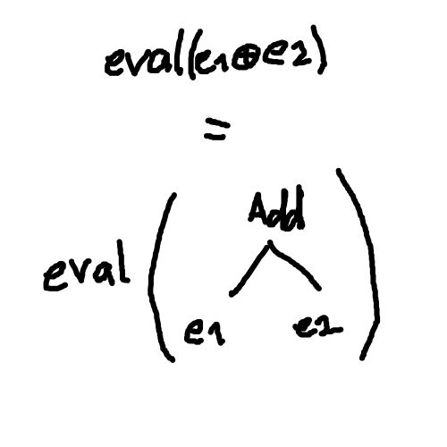
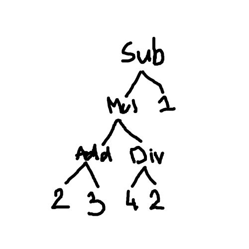

# Langages et Traducteurs

$$
ExpN := n (\mathbb{N})\; |\; ExpN \oplus ExpN\; |\; ExpN \ominus ExpN\; |\; ExpN \otimes ExpN\; |\; \empty
$$

1. Écrire une fonction récursive d'évaluation ExpN $\rightarrow$ $\mathbb{N}$

   - $eval(n) = n$
   - $eval(e1 \oplus e2) = eval(e1) + eval(e2)$

    

   - $eval(e1 \ominus e2) = \text{ si } (e2 > e1) \text{ alors } 0 \text{ sinon } e1 - e2$
   - $eval(e1 \otimes e2) = e1 \times e2$
   - $eval(e1 \oslash e2) = e1 / e2$

2. Dessiner l'arbre pour $((2 \oplus 3) \otimes (4 \oslash 2)) \ominus 1$

    

3. L'évaluer :

    $$
    \begin{array}{lcl}
    ((2 \oplus 3) \otimes (4 \oslash 2)) \ominus 1 & = & \text{ si } eval(...) < eval(1) \text{ alors } 0 \text{ sinon } eval(...) - eval(1) \\
    &&\\
    ((2 \oplus 3) \otimes (4 \oslash 2)) & = & eval(2 \oplus 3) \times eval(4 \oslash 2) \\
    & = & (eval(2) + eval(3)) \times (eval(4) / eval(2)) \\
    & = & (2 + 3) \times (4 / 2) \\
    & = & 10 \\
    &&\\
    ((2 \oplus 3) \otimes (4 \oslash 2)) \ominus 1 & = & eval(...) - eval(1) \\
    & = & 10 - 1\\
    & = & 9\\
    \end{array}
    $$

4. Démontrer par récurrence structurelle que si une expression 1 + 2 s'évalue en un résultat pair :
      1. ne contenant que des $n$ pairs
      2. sans $\oslash$
   Démonstration :
      - **Cas 1.** $ExpN$ est $n$ : $n$ ne contient que des pairs et pas de $\oslash$ donc $n$ pair
      - **Cas 2.** $ExpN$ est $e1 \oplus e2$ : $eval(e1 \oplus e2) = eval(e1) + eval(e2) = e1 + e2$ or $e1$ et $e2$ sont pairs et la somme de deux nombres pairs est paire donc c'est pair
      - **Cas 3.** $ExpN$ est $e1 \ominus e2$ : $eval(e1 \ominus e2) = \text{ si } (e2 > e1) \text{ alors } 0 \text{ sinon } e1 - e2$
        - **Cas a.** $0$ est pair donc c'est pair
        - **Cas b.** $e1$ et $e2$ sont pairs et la soustraction de deux nombres pairs est paire donc c'est pair
      - **Cas 4.** $ExpN$ est $e1 \otimes e2$ : $eval(e1 \otimes e2) = eval(e1) \times eval(e2) = e1 \times e2$ or $e1$ et $e2$ sont pairs et il suffit que l'un des deux membres d'une multiplication soit pair pour que le résultat soit pair donc c'est pair
