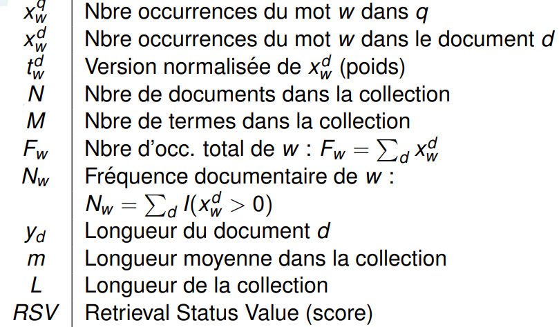

# RI 2 - Accès et recherche d'information

**Slide** : <https://hmul8r6b.imag.fr/lib/exe/fetch.php?media=accesinfoiii-ix.pdf.pdf>

## Modèles standards de recherche

**Notations :**

### Modèle booléens (simple)

- Les poids sont $1$ ou $0$
- Les requêtes sont des expressions booléennes : `Météo` $\vee$ `Grenoble`

Passer en forme disjonctive :
`programmation` $\wedge$ `langage` $\wedge$ (`C` $\vee$ `java`) $\rightarrow$ [`prog.` $\wedge$ `lang.` $\wedge$ `C`] $\vee$ [`prog.` $\wedge$ `lang.` $\wedge$ `java`]

Le **RSV** (score) est $1$ si au moins un bloc de la requête en forme disjonctive est satisfait, $0$ sinon.

Le modèle est **limité** car à partir du moment où la requête est acceptée on ne peut pas la différencier entre les documents : pas d'ordre dans les réponses (problème de **pertinence binaire**). Aussi il n'est pas évident de formuler une bonne requête booléenne pour l'humain. L'avantage est la **facilité d'implémentation** de ce modèle.

> **Remarque.** Ce modèle peut être utilisé comme premier filtrage pour réduire la taille d'un filtrage plus avancé.

> **Remarque.** Ce modèle est à la base de beaucoup de systèmes commerciaux.

### Modèle vectoriel (classique)

Répond aux 2 défauts du modèle précédent : poids et pertinences binaires.

### Modèle probabiliste (un peu mieux)

## Évaluation

.
