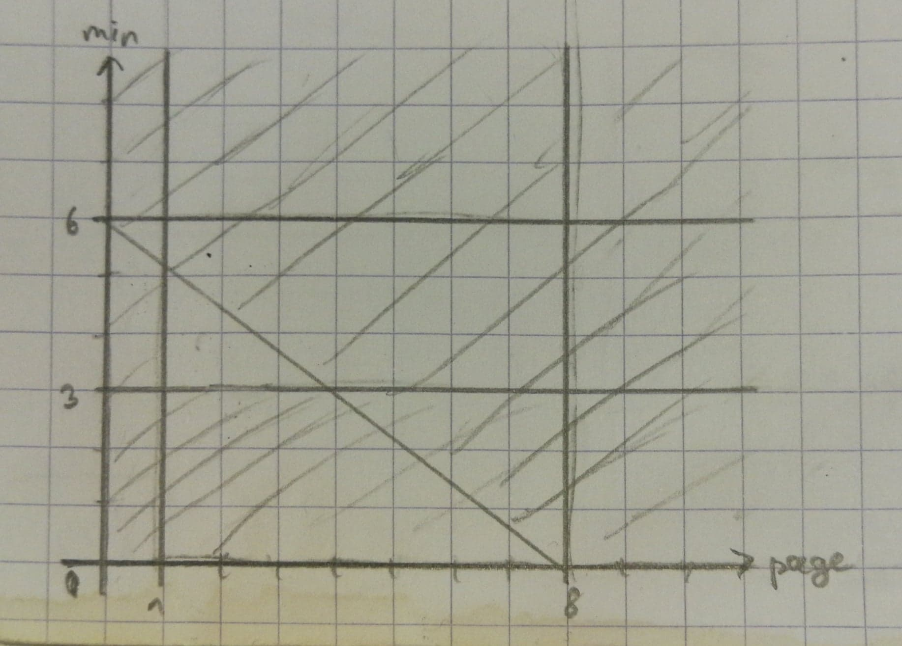

# Recherche Opérationnelle TD 1

## Exercice 1. Bière

- Variables (3) : $$x_{HS}$$, $$x_{HR}$$, $$x_D$$ (vins en gallons)
- Fonction objectif (1, toujours) : max $$10x_{HS} + 12x_{HR} + 20x_D$$
- Contraintes (7) :
  - Positivité : $$x_{HS}, x_{HR}, x_D \ge 0$$
  - raisin type A : $$1x_{HS} + 2x_{HR} \le 150$$ (boisseaux $$/$$ gallons $$\times$$ gallons = boisseaux)
  - raisin type B : $$1x_{HS} + 2x_D \le 150$$
  - sucre : $$2x_{HS} + 1x_{HR} \le 80$$
  - main d'œuvre : $$2x_{HS} + 3x_{HR} + 1x_D \le 225$$

## Exercice 2. Publicité

- Variables (2) : $$x_{TV}$$, $$x_J$$ (# minutes ou pages)
- Fonction objectif (1, toujours) : max $$100000x_{TV} 80000x_J$$
- Contraintes (7) :
  - Positivité : $$x_{TV}, x_J \ge 0$$
  - Minimums : $$x_{TV} \ge 3, x_J \ge 1$$
  - Budget : $$800x_{TV} + 600x_J \le 4800$$

Pour dessiner un **graphique** (nommbre de minutes en fonction du nombre de pages) on va chercher à hachurer les zones impossibles pour connaître toutes les configurations possibles. D'abord on hachure **avant 3 minutes** et **avant 1 page**, puis on va tracer une **droite du budget** au-dessus de laquelle on va hachurer. Pour cette droite il nous faut deux points, on utilise la contrainte de budget :

$$
800x_{TV} + 600x_J = 4800 \Leftrightarrow 8x_{TV} + 6x_J = 48
$$

On annule chacun des deux variables pour avoir deux points :

$$
0 + 6x_J = 48 \Leftrightarrow x_J = 8
$$

$$
8x_{TV} + 0 = 48 \Leftrightarrow x_{TV} = 6
$$

On a deux points : $$(8, 0)$$ et $$(0, 6)$$

## Exercice 3

## Exercice 4
