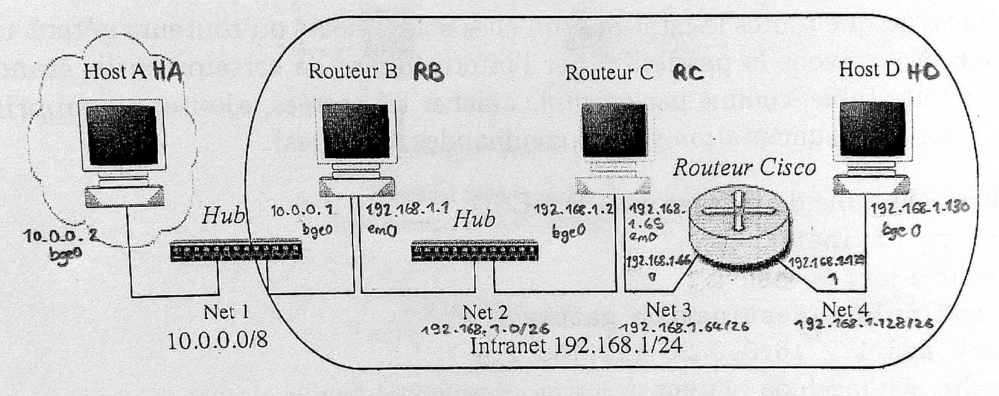

% Réseaux - Compte-rendu TP1
% Alan Guivarch - Mica Murphy - Claire Velut
% Lundi 23 septembre

# 3.1 Manipulation des tables de routages

2. Plan d'adressage

  

3. Configurations des quatre machines :

   - Host A (HA) :

     ```bash
     route add 0.0.0.0/0      10.0.0.1        # Net 2, 3, 4
     ```

   - Routeur B (RB) :

     ```bash
     route add 192.168.1.64/26  192.168.1.2   # Net 3
     route add 192.168.1.128/26 192.168.1.2   # Net 4
     ```

   - Routeur C (RC) :

     ```bash
     route add 10.0.0.0/8       192.168.1.1   # Net 1
     route add 192.168.1.128/26 192.168.1.66  # Net 4
     ```

   - Host D (HD) :

     ```bash
     route add 0.0.0.0/0        192.168.1.129 # Net 1, 2, 3
     ```

\newpage

1. Chronogramme

  

\newpage

5. `traceroute` envoie 3 paquets avec time to live (TTL) à 1, puis si ça ne suffit pas, il recommence en incrémentant de 1 à chaque nouveau groupe de 3 paquets.

```text
(de A à B, TTL = 1)
traceroute to 10.0.0.1 (10.0.0.1), 64 hops max, 40 bute packets
 1  10.0.0.1 (10.0.0.1) 0.788 ms  0.206 ms  0.360 ms

(de A à C, TTL = 2)
traceroute to 192.168.1.2 (192.168.1.2), 64 hops max, 40 bute packets
 1  10.0.0.1 (10.0.0.1) 0.474 ms  0.331 ms  0.328 ms
 2  192.158.1.2 (192.158.1.2) 0.969 ms  0.502 ms  0.490 ms

(de A à D, TTL = 4)
traceroute to 192.168.1.130 (192.168.1.130), 64 hops max, 40 bute packets
 1  10.0.0.1 (10.0.0.1) 0.478 ms  0.363 ms  0.207 ms
 2  192.158.1.2 (192.158.1.2) 0.358 ms  0.504 ms  0.336 ms
 3  192.158.1.66 (192.158.1.66) 0.813 ms  0.975 ms  0.651 ms
 4  192.158.1.130 (192.158.1.130) 0.487 ms  0.663 ms  0.668 ms

(de C à D, TTL = 2)
traceroute to 192.168.1.130 (192.168.1.130), 64 hops max, 40 bute packets
 1  192.158.1.66 (192.158.1.66) 0.362 ms  0.317 ms  0.320 ms
 2  192.158.1.130 (192.158.1.130) 0.496 ms  0.498 ms  0.349 ms
```

# 3.2 Fonctionnement du protocole RIP

3. a.

  - Les paquets capturés sont envoyés par B et C qui sont en mode supply. Les paquets sont envoyés en broadcast et contiennent les adresses réseau que leur envoyeur connaît pour les communiquer. Ils indiquent aussi la métrique pour que le récepteur du paquet sache à quelle distance il est du réseau.

  - Oui cette version de RIP implémente bien la méthode "split horizon". Les paquets ne contiennent pas toute la table de routage de l'émetteur mais contiennent des informations différentes en fonction du réseau sur lequel il les envoie. Les paquet envoyés sur un réseau X ne contiennent pas les adresses des réseaux que l'émetteur a appris depuis le réseau X. Cette méthode empêche à un routeur d’envoyer des informations (de métrique plus élevée) à travers l’interface de laquelle elle a appris l’information pour éviter les boucles de routage.

  b. On peut connaître les netmasks associés aux adresses de réseau à introduire dans la table de routage grâce aux classes. RIPv1 calcule les netmasks de l’adresse des réseaux qu’il met dans la table de routage à partir de l’adresse IP elle-même. RIP peut s'en sortir avec les netmasks que nous avons décidé d'utiliser pour les sous-réseaux si ceux ci ne finissent pas par des 0 car ainsi il considère les 0 de fin comme étant ce qu'il faut masquer avec le netmasks.

5. RIP ne transmet pas les routes statiques et les routes par défaut.

6. Juste après avoir tué le démon RIP sur C, on observe sur le réseau net3 des paquets envoyée par C avec la distance de C vers tous les réseaux valant 16. Cela indique au réseau que C n’existe plus.
Ensuite, le routeur CISCO du réseau envoie des réponses à D sur le réseau net4 qui indiquent que le réseau net3 est maintenant à une métrique de 16 car il n’est plus accessible.
Après une minute, l’entrée du réseau net3 qui avait une métrique de 16 disparaît complètement des paquets.

\newpage

7. Comme le processus est tué immédiatement, il n'a pas le temps d'envoyer les paquets de fin de vie à ses voisins et leur table ne sera pas mise à jour immédiatement. Elles seront mises à jour après le timeout des adresses enregistrées, pendant le laps de temps où les timeouts ne sont pas finis le réseau sera perturbé : D ne pourra ni envoyer ni recevoir de messages des autres machines.

8. En créant un réseau entre A et D, les routes peuvent changer. Par exemple pour aller de A à C on a désormais deux chemins possibles avec la même métrique : en passant par B ou en passant par D. Le chemin choisi sera celui dont la réponse est la plus rapide, cela dépend donc des machines et de leur connexion. Une route qui changera de manière certaine c'est celle qui permet d'aller de A à D, elle ne passera plus par B et C mais ira directement de A à D.

9. Oui cette version de RIP implémente la méthode appelée "route poisoning". Pour s'en convaincre on peut refaire l'expérience de la question 6 qui illustrait bien cette méthode.

10. Oui cette version de RIP implémente la méthode de "mise à jour déclenchée". Pour s'en convaincre on peut faire l’expérience de la question 6 puis relancez le démon RIP sur C. En effet lorsqu'on relance le démon RIP sur C le routeur CISCO qui va recevoir à nouveau des paquets provenant de C va immédiatement propager l'adresse et la métrique de C vers le routeur D.

11. d. Le multicast permet d'envoyer les informations à un ensemble restreint de destinataires plutôt qu'à tout le monde et ainsi de réduire le nombre de messages qui transitent sur le réseau. RIPv2 communique en plus les masques de sous-réseaux associés aux adresses réseaux et une identification sommaire est ajouté aux paquets qui rajoute notamment un mot de passe crypté avec MD5 aux paquets.

\newpage

# 3.3 `Traceroute` en vrai

On a fait un `traceroute` vers l'adresse distante `google.com`. On passe par 13 intermédiaires avant d'arriver à destination, on a donc **un TTL à 13**. Au lancement de traceroute, le paquet envoyé a **un TTL à 1** pour atteindre le premier intermédiaire, puis un autre est envoyé avec un TTL incrémenté de 1 pour atteindre le prochain intermédiaire et ainsi de suite jusqu'à la destination (qui se trouve ici à une distance de 13). Ces intermédiaires sont très rapides (surtout le premier comme il est très proche) parce qu'ils sont souvent dédiés entièrement au routage et conçus pour supporter une grande charge.

```text
# ping google.com
PING google.com (172.217.19.46): 56 data bytes
64 bytes from 172.217.19.46: icmp_seq=0 ttl=51 time=7.828 ms
64 bytes from 172.217.19.46: icmp_seq=0 ttl=51 time=7.976 ms
--- google.com ping statistics ---
2 packets transmitted, 2 packets received, 0.0% packet loss
round-trip min/avg/max/stddev = 7.929/7.902/7.976/0.074 ms

# traceroute -n google.com
traceroute to google.com (172.217.19.46), 64 hops max, 40 byte packets
 1  152.77.84.1     0.288 ms    0.276 ms    0.274 ms
 2  152.77.32.145   17.218 ms   22.016 ms   22.148 ms
 3  152.77.39.30    17.427 ms   13.921 ms   21.932 ms
 4  152.77.39.70    0.548 ms    0.591 ms    0.628 ms
 5  193.54.184.5    0.846 ms    1.009 ms    0.780 ms
 6  193.54.185.1    4.945 ms    8.174 ms    8.034 ms
 7  193.51.181.94   1.348 ms    0.533 ms    1.455 ms
 8  193.51.177.57   3.330 ms
    193.51.180.57   8.787 ms
    193.51.180.51   3.082 ms
 9  193.51.180.67   7.206 ms    9.206 ms    8.206 ms
10  72.14.218.132   7.648 ms    7.928 ms    7.645 ms
11  108.170.252.225 8.534 ms
    108.170.252.241 9.534 ms    8.443 ms
12  66.249.95.55    17.252 ms
    72.14.233.67    14.722 ms
    66.249.95.55    15.449 ms
13  172.217.19.46   7.685 ms    7.078 ms    7.559 ms
```

# Annexe

Le démon RIPv1 pourra être mis en défaut en donnant des adresses sans classe aux réseaux. En effet l'algorithme de RIPv1 va associer le mauvais netmask aux adresses sans classe.
