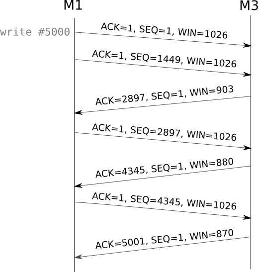
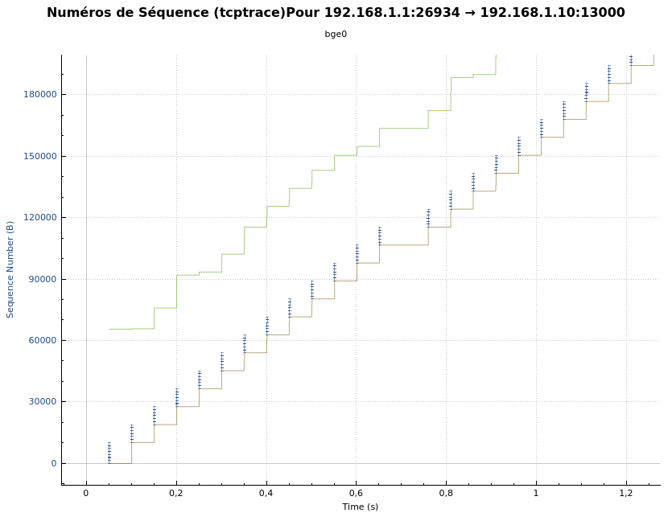

% Réseaux - Compte-rendu TP2
% Alan Guivarch - Mica Murphy - Claire Velut
% Lundi 21 octobre

# 1. Établissement d'une connexion

- Lors de l’établissement de la connexion, trois paquets sont échangés :
  - [SYN] : demande de connexion de M11 à M32
  - [SYN, ACK] : acceptation de M32
  - [ACK] : acquittement de M11

- Lors de l'ouverture de connexion, TCP utilise plusieurs options :
  - `End of option :` est un octet qui indique la fin de la partie option et le début de la partie data.
  - `No-Operation :` est un octet qui sert de padding.
  - `Maximum segment size :` définit la taille maximum de segment des paquets TCP sortants (de priorité en-dessous des bornes imposées par TCP).
  - `Window scale :` correspond au nombre d’octets à partir de la position marquée dans l’accusé de réception que le récepteur est capable de recevoir.
  - `Timestamps :` active ou désactive les timestamps et définit les offsets (aléatoires ou non).
  - `SACK permitted :` accusé de réception sélectif qui permet de connaître quels bouts de paquets ont été reçus et ainsi de ne retransmettre que les paquets non reçus.

# 2. Étude de la récupération d'erreur

## 2.1. Numéro de séquence et d'acquittement

- Le `sequence number` permet d’identifier les demandes de connexion et de numéroter les octets de données. Le `ack.number` est le numéro de séquence du dernier octet bien arrivé, il permet à l’émetteur de savoir si le récepteur à bien reçu toutes les données ou s’il doit renvoyer des paquets non reçus.
- Il n'y a pas forcément un acquittement par paquet, cela permet d'envoyer moins de paquets en acquittant plusieurs paquets en même temps.

## 2.2. Retardement d'acquittement

- Temps d'arrivée 0.10 s
- Temps de retour des acquittements 0.20 s = 0.10 * 2 s
- delacktime vaut 100 ms? soit 0.10 s
Pour 10 000 octets:
- Temps d'arrivée 0.14 s
- Temps de retour des acquittements : 0.28

- Le retard d'acquittement permet d'envoyer moins de paquets d'acquittement en envoyant un acquittement pour plusieurs paquets reçus. Cependant, avec un délai trop grand, il y a un risque que l'émetteur renvoie un paquet pour rien car il n'a pas encore été acquitté et que son timer est arrivé à sa fin. En conclusion, il faut acquitter avant la fin du timer de l'autre.

## 2.3. Augmentation du délai sur le routeur

## 2.4. Temporisateur de retransmission

- Au depart c'est 0.80s soit 4 fois le RTT (0.20). Il attend 4 fois la possibilité d'un aller-retour avant de retransmettre. La durée du timer double à chaque tentative pour ne pas saturer le réseau au cas où le récepteur n'est plus accessible.

## 2.5. Paramètres TCP

- Les paramètres `net.inet.tcp.sendspace` et `net.inet.tcp.recvspace` contrôlent la quantité d'espace allouée aux buffers d'émission et de réception pour chaque connexion TCP.

## 2.6. Fenêtre à anticipation et buffer d'émission

- On peut voir sur le graphe ci-dessus 2 courbes. La courbe marron correspond aux paquets émis et acquitté tandis que la courbe verte correspond aux paquet lu par le récepteur.
En effet on peut voir que la courbe verte démarre aux environs du numéro de séquence 65 000 qui correspond à la taille du buffer de réception.
Les points bleus au-dessus de la courbe marron correspondent aux paquets envoyés, on peut voir que plusieurs paquets de 1448 sont envoyés jusqu'à la taille d'envoi de 10 000. Ensuite l’émetteur attend l’acquittement des paquets. C'est le premier pallier de la courbe marron. Quand la courbe monte à la verticale cela correspond aux acquittements des paquets préalablement envoyés. On peux voir sur la courbe qu'une fois les paquets acquittés, de nouveaux paquets sont envoyés jusqu'à atteindre la taille de l'espace d’envoi.
Ensuite l’émetteur se met de nouveau en attente d’acquittement et ainsi de suite.

- Avec un temps de latence très long (ici 50ms) si l’émetteur attend un acquittement après l'envoi de chaque paquet la transmission deviens très lente.
La fenêtre d'anticipation correspond donc au nombre de paquets que l'on se permet d'envoyer avant de recevoir un premier acquittement de réception.
Sur la courbe la fenêtre d'anticipation est représenté par les points bleus qui sont au-dessus de la courbe marron car ils apparaissent sur la courbe dès que des paquets ont été acquittés et une fois qu'ils sont tous envoyés il y a un temps d'attente (une ligne horizontale sur la courbe) qui correspond a l'attente d’acquittement.

- On retrouve l'influence de la taille du buffer d'émission dans cette courbe au niveau de la taille des "marches" de la courbe marron qui sont toujours d'environ 10 000 numéros de séquence ce qui correspond à la taille du buffer.

### 2.6.1. Influence de la taille du buffer d'émission sur le débit applicatif

- Comme on limite la taille à 1460 l’émetteur est obligé d'envoyer 2 paquets pour transmettre les 1460 octets, on remarque qu'il envoie à chaque fois 2 paquets de 1448 et un paquet de 24 qui contient donc les 12 octets restant de chaque paquet de 1448. Puis on peut observer les acquittements des 3 paquets.
- La différence s'observe dans le nombres de paquets envoyés et le nombre d’acquittements.
- *Expérience avec un buffer de 1460 octets*
  - Pour 40 paquets on note le timestamp du premier paquet et on y soustrait le timestamp du dernier paquet : **50,9527 - 0,0209 = 50,9318 s**
  - Avec 40 paquets on a 20 paquets de donnée et 20 paquets d'acquittement, donc chaque "groupe de paquets de données" pour envoyer un message de 1460 octets est composé de 3 paquets de données : **20 / 2 = 10 messages**
  - On divise la durée calculée précédemment par par le nombre de messages : **50,9318 / 10 = 5,0939 s**
  - On divise le nombre d'octets de chaque message par le temps précédent (temps que mettrait l'ordinateur à envoyer la taille du buffer) et on multiplie par 8 pour avoir le résultat en bits : **1460 / 5,0939 * 8 = 2 292,939 bits/s = 2,293 kbits/s**
- *Même expérience avec un buffer...*
  - *... de 3000 octets* : de la même manière que précédemment on trouve un débit applicatif de : **3000 / 0,0188 * 8 = 1 276 595 bits/s = 1 276,595 kbits/s**
  - *... de 10 000 octets* : de la même manière que précédemment on trouve un débit applicatif de : **10 000 / 0.0224696 * 8 = 3 560 366 bits/s = 3 560,366 kbits/s**
- Plus le buffer d'émission est grand plus le débit est grand, tant que le buffer d'émission est inférieur au buffer de réception, si ça fait trop pour le récepteur.

- Pour trouver la taille optimale du buffer d’émission on fait le calcul suivant :
  - On considère le débit physique à 10 Megabits/s pour un cable éthernet en paire torsadée qui suit la norme 10baseT.

  $$
  \begin{array}{lcl}
  \text{Taille buffer} & = & \text{ RTT } \times \text{ débit physique}\\
  & = & 0,020 \text{ s} \times 10 \text{ Mbit/s} = 0,2 \text{ Mbit}\\
  & = & 200000 \text{ bits}\\
  & = & 25 \text{ ko}\\
  \end{array}
  $$

  - Donc pour obtenir un débit optimal il faut une taille de buffer de 250 koctets.

- Si le buffer d'émission est optimal c'est que l'émetteur peut émettre en continu et le récepteur recevoir en continu donc dans ce cas on n'a pas besoin de l'option WinScale.

\newpage

## 2.7. Cas de pertes dans la fenêtre à anticipation

*Nous n'avons pas eu le temps de faire cette partie.*

<!--
- TODO
- TODO
- TODO
- TODO
- TODO
- TODO
-->

# 3. Contrôle de flux

## 3.1. Principe

- L’émetteur continue d'envoyer des paquets d'un octet de données pour savoir quand le récepteur pourra de nouveau recevoir des données.
- Le temporisateur commence à 5 secondes et double jusqu'à atteindre 1 minute.

- Le récepteur ne débloque pas tout de suite la situation car si il débloquait la situation dès le premier octet lu, l'émetteur enverrait les octets 1 à 1. Ainsi, il attend d'avoir 1448 octets de libres dans son buffer de réception pour que l'émetteur puisse lui envoyer un paquet plein. Cela permet de ne pas saturer le réseau avec plein de petits paquets.

## 3.2. Influence de la taille du buffer de réception

- Le buffer d'émission permet d'envoyer un nombre d'octets correspondant à sa taille sans attendre d'acquittement entre chaque paquet et ainsi de conserver les données envoyées. Car si aucun acquittement n'a été reçu à la fin du timer alors on a encore les données et on peut les renvoyer. Ainsi le buffer en émission sert à la récupération d'erreurs.
Le buffer de réception permet de recevoir plusieurs paquets sans avoir besoin de les traiter un à un et d'envoyer un acquittement pour chaque. Il est donc utilisé pour le contrôle de flux.
- L'utilisation d'un buffer d'émission de taille supérieure à celui de réception n'est pas pertinente car on ne pourra jamais envoyer plus que ce que le récepteur ne peut recevoir. Le débit est limité par le récepteur.
- Par contre il peut être intéressant d'avoir un buffer de réception plus grand qu'en émission si le rythme de traitement du récepteur est sporadique.
