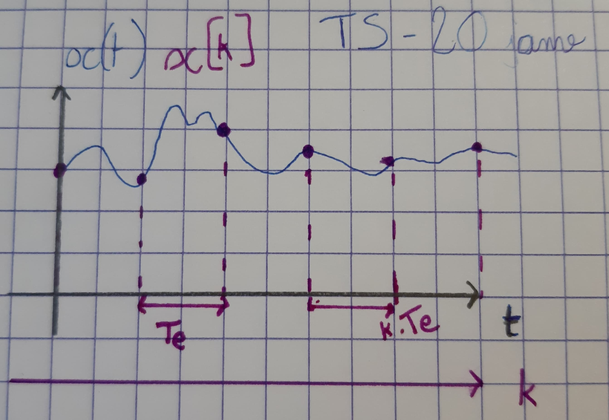
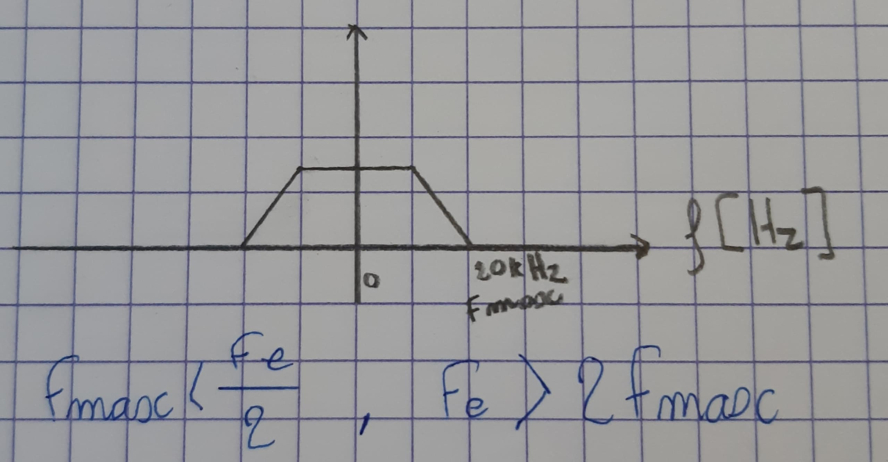
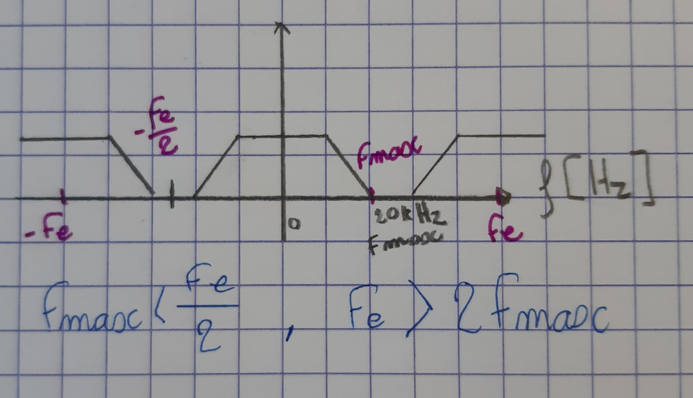
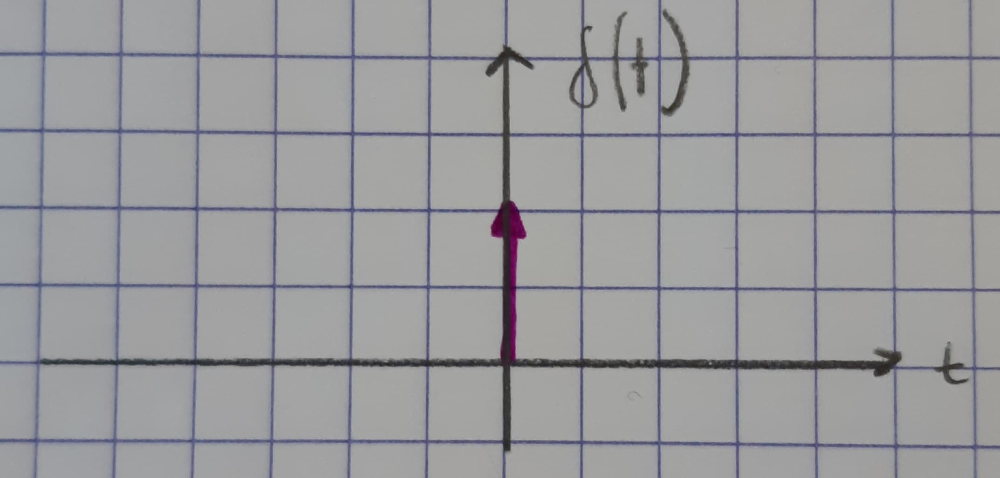
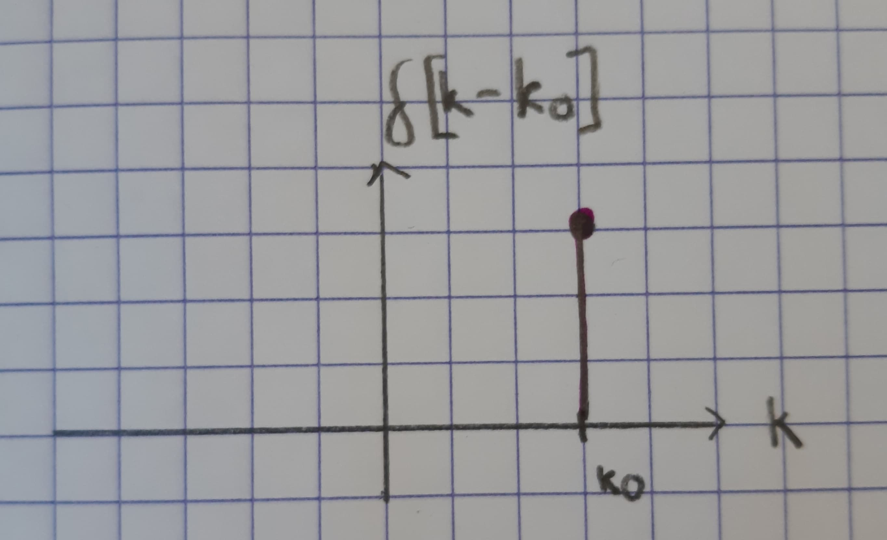
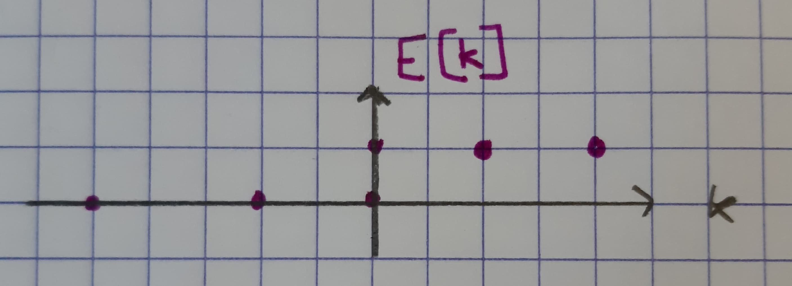
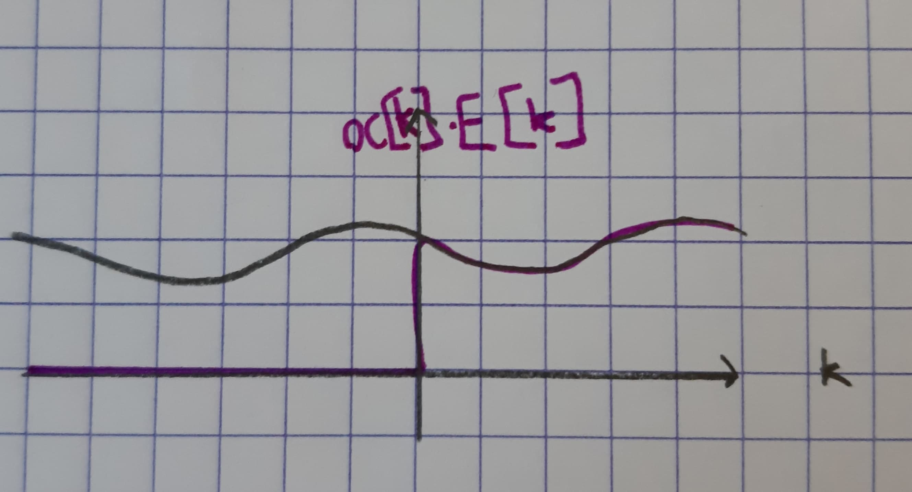
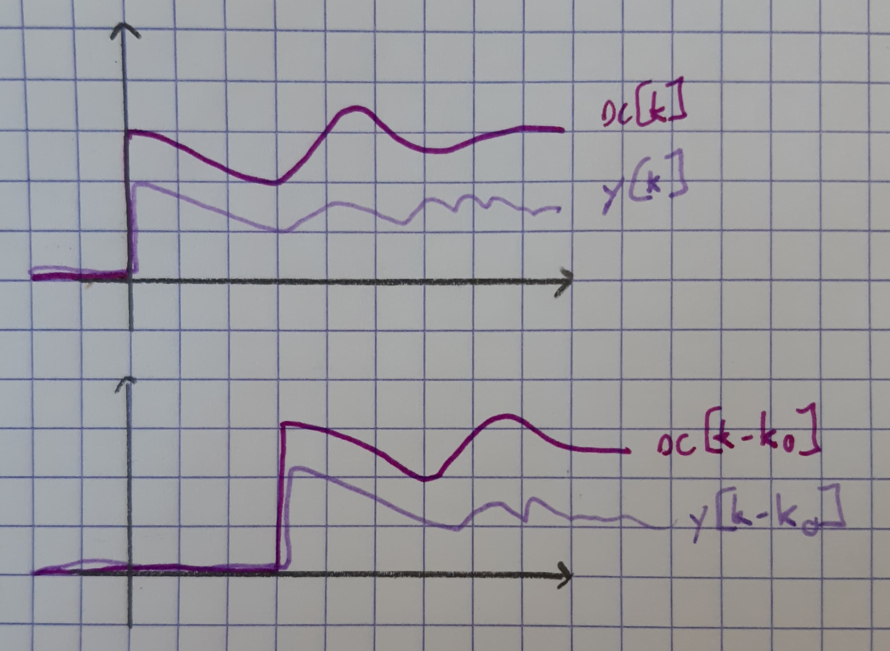

# TS 1 - Introduction

**Exam + CC + Quicks**

**Exam 70%** 2H

**CC 25%** : DM + CR de TP

**Quicks 5%** en début de cours

Cours : <anne.guerin@gipse-lab.grenoble-inp.fr>

TP : <patricia.ladret@gipse-lap.grenoble-inp.fr>

## Signaux numériques

PDF : <https://im2ag-moodle.e.ujf-grenoble.fr/pluginfile.php/42985/mod_resource/content/1/Notes_Cours_2019_Chapitre1.pdf>

### Définitions

Signal discret en temps : $x[k]\; k \in \mathbb{Z}$

Signal continu en temps : $x(t)\; t \in \mathbb{R}$

On passe de $x(t)$ à $x[k]$ en échantillonnant à une période ${1 \over F_e} = T_e$



> *Notation.* Minuscule en temps, majuscules après transformée

**Théorème de Shannon.** $F_{\max} < {F_e \over 2}$ ou autrement écrit $F_e > 2F_{\max}$



> Si la fréquence maximale est 20kHz alors la fréquence d'échantillonage doit être au moins deux fois 20000kHz.

*Pourquoi ?* Échantilloner en temps périodise en fréquence donc les fréquences vont se répéter avec une période $F_e$. Pour ne pas avoir de chevauchement des fréquences (ou *repliement de spectre*), il faut respecter le Théorème de Shannon.



> La transformée en temps discret est périodique de période $F_e$.

### Signaux communs

#### Impulsion de Dirac

Grossièrement, c'est une impulsion en 0 avec une aire de 1 (donc pas nécessairement de hauteur 1).

**Numérique.** Noté $\delta[k]$                         | **Analogique.** Noté $\delta(t)$
--------------------------------------------------------|---------------------------------------------
$k = 0\; \delta[k] = 1$                                 | $\lim\limits_{t \to 0} \delta(t) = + \infty$
$k \neq 0\; \delta[k] = 0$                              | $t \neq 0\; \delta(t) = 0$
$\sum\limits_{k=-\infty}^{+\infty} \delta[k] = 1$       | $\int_{-\infty}^{+\infty} \delta(t) dt = 1$
 | 


#### Échelon

$\epsilon[k] = \left\{\begin{array}{ll}
1, & k \geq 0\\
0, & k < 0\\
\end{array}\right.$





#### Rectangle

$\text{Rect}_K[k] = \left\{\begin{array}{ll}
1, & 0 \leq k < K\\
0, & \text{sinon}\\
\end{array}\right.$

> $\text{Rect}_K[k]$ est un signal de durée $K(K \times T_e)$.

#### Signal exponentiel

$$x|k] = a^k (\times \epsilon[k])$$

#### Signal sinusoïdal / cosinusoïdal de période $K$

$$x|k] = A \sin\Big(2 \pi {k \over K}\Big)$$

$$x|k] = A \cos\Big(2 \pi {k \over K}\Big)$$

## Systèmes numériques

```text
x[k] -> [ S ] -> y[k]
```

$$
y[k] = S\{x\}[k]
$$

### Linéaire

$$
\begin{array}{lcl}
\alpha_1 y_1[k] + \alpha_2 y_2[k] & = & S\{\alpha_1 x_1[k] + \alpha_2 x_2[k]\}[k]\\
 & = & \alpha_1 S\{x_1[k]\} + \alpha_2 S\{x_2[k]\}[k]\\
\end{array}
$$

### Causalité

Un système est causal quand il est excité ($\neq 0$) à partir de 0 et pas avant.

> Une conséquence ne peut arriver avant la cause.

Le système spatiaux comme une image en 2D ne peuvent pas appliquer le principe de causalité. Cela dit, pour un signal vidéo, structuré par le temps, on peut appliquer le principe de causalité sur le temps. Ce n'est pas le cas d'une image fixe qui est uniquement structurée par ses pixels.

### Invariance en temps (SLIT)

$$y[k] = S\{x\}[k]$$

$$S\{x[k - k_0]\}[k] = y[k - k_0]$$



> En cours nous allons utiliser des systèmes invariants en temps, mais pas tous causaux.

## Équations aux différences

```text
x[k] -> [ S ] -> y[k]
```

On a vu qu'on s'intéressait en cours uniquement aux Systèmes Linéaires Invariants en Temps (= SLIT). Tous les SLIT sont tels que la relation entre $y$ et $x$ est régie par $S$ : une équation aux différences.

$$
\sum\limits_{n=0}^{N} a_ny[k - n] = \sum\limits_{m=0}^{M} b_m x[k - m]
$$

$$
a_0 y[k] + a_1 y[k - 1] + ... + a_N y[k - N] = b_0 x[k] + b_1 x[k - 1] + ... + b_M x[k - M]
$$

$$
y[k] = {1 \over a_0}[(b_0x[k] + \dots + b_nx[k - n]) - (a_1y[k-1] + \dots + a_Ny(k - N))]
$$

**Interprétation.** La sortie à l'instant présent est égale à la combinaison linéaire des entrées à l'instant présent et au passé soustrait à la combinaison linéaire du passé des sorties.

> *Remarque.* Connaître $S$ c'est comme connaître tous les paramètres $\{a_n | n=0...N ; b_m | m=0...M\}$.

*Exemple.* Le filtre gradient (dérivée dans $\mathbb{Z}$)

- $y[k] = x[k] - x[k - 1]$
- $a_0 = 1$, $a_n = 0$, $b_0 = 1$
- $b_1 = -1$, $b_n = 0$
- Ordre 1

> L'ordre du filtre correspond à "jusqu'à combien on regarde dans le passé".

Un filtre est dit **récursif** lorsqu'il **utilise les sorties** passées du filtre pour calculer le présent. Sinon, le filtre est dit **direct**.

*Exemple.* Filtre récursif.

- $y[k] = x[k] - y[k - 1] + y[k - 2]$
- $a_0 = 1$, $a_1 = 1$, $a_2 = 1$
- $b_0 = 1$
- Ordre 1

.
