% SI TP1 -- Prise en main d'*OpenGL*
% Claire VELUT et Mica MURPHY
% Vendredi 15 janvier 2020

# Dessiner un triangle en mode immédiat

Nous avons dessiné un triangle avec deux couleurs différentes, une pour le haut et une pour le bas.

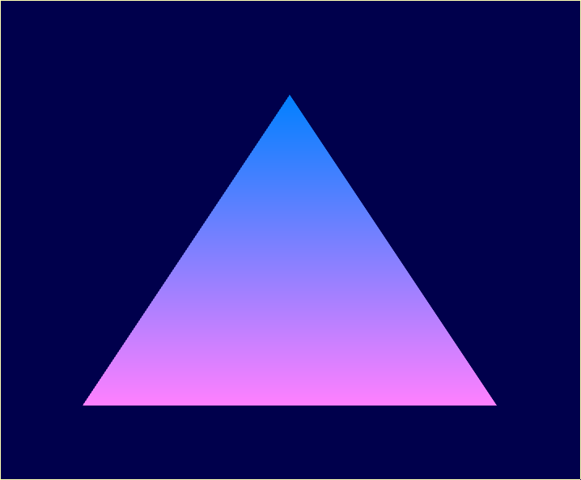

\newpage

# Utiliser les shaders

Nous avons utilisé notre propre shader ce qui a effectivement rendu notre triangle tout rouge.

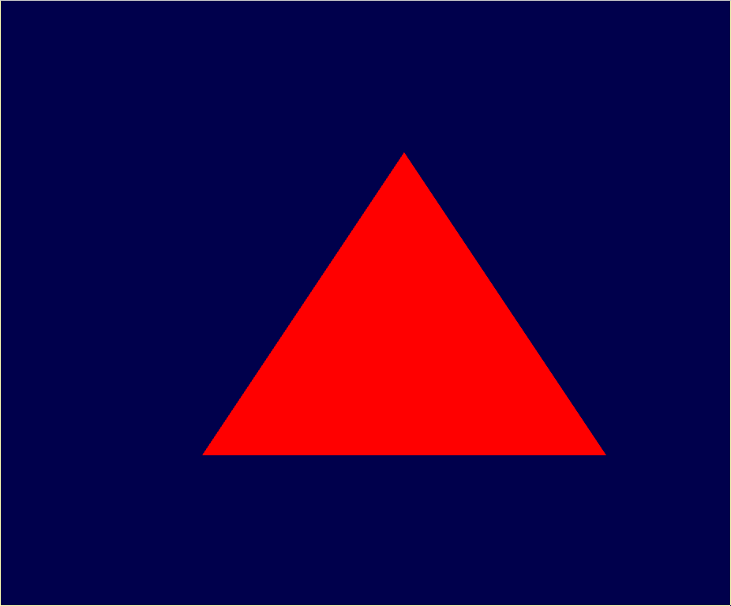

# Dessiner un triangle avec un VAO+VBO(s)

Nous avons utilisé un buffer et obtenu le même triangle qu'à la question précédente.

\newpage

# À vous de jouer

- Lorsqu'on utilise la fonction `glPolygonMode` le tringle n'est pas plein, seuls les contours du triangle s'affichent.

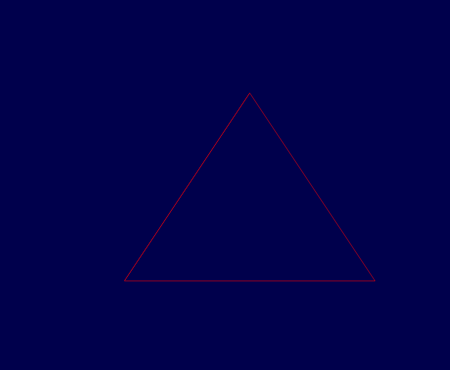

\newpage

- Nous avons changé la couleur de fond avec `glClearColor()` à la fin de la boucle. Le deuxième paramêtre de la fonction, celui pour le vert, est initialisé à `0.0f + i/1000.0f` pour que la couleur du fond change en fonction de l'indice `i` de la boucle.

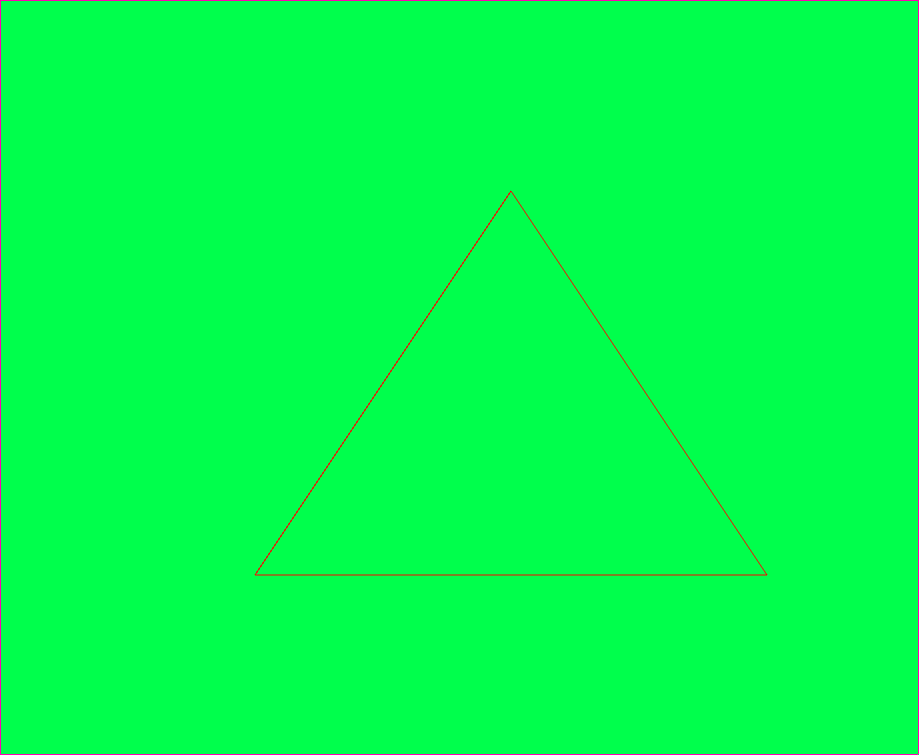

\newpage

- Nous avons changé la couleur du triangle en changant la variable `gl_FragColor` dans le fragment shader (avant il était rouge, maintenant il est mangenta).

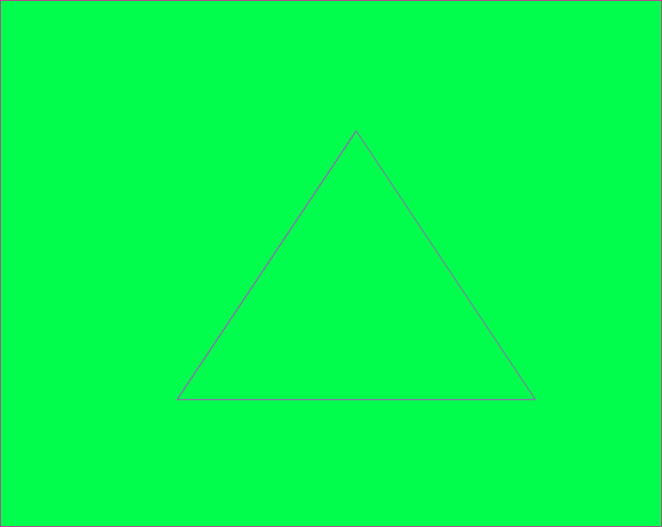

\newpage

- Nous avons créé un carré à l'aide de 2 triangles. Pour cela nous avons ajouté 3 points au buffer VOB. À l'affichage le carré est plutôt un rectangle.

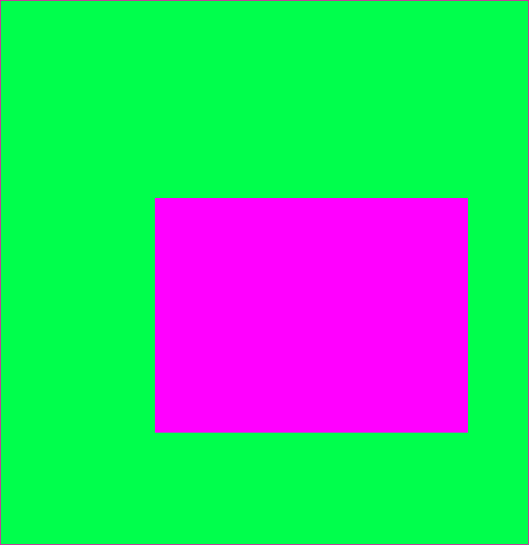

\newpage

- Nous avons créé une maison en ajoutant un triangle en haut du carré pour faire le toit.

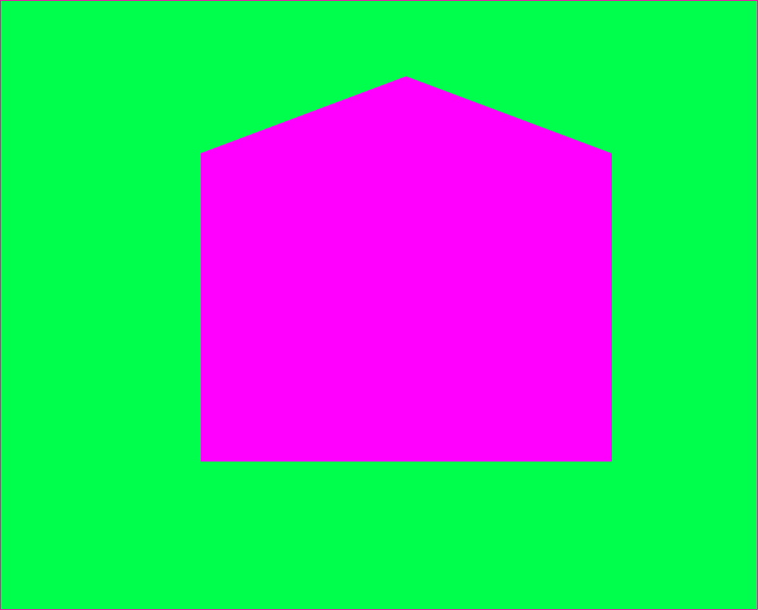

\newpage

- Nous avons essayé les primitives suivantes :
  1. GL_POINTS : Nous avons afficher les 4 points avec le tableau de vecteurs commenté avec le titre `points`. `GL_POINTS` affiche un point par vecteurs présent dans le buffer.

  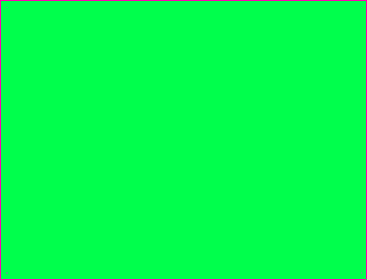

\newpage

  2. GL_LINES : Nous avons fait un noeud papillon avec 4 lignes. `GL_LINES` créer une ligne entre 2 points présents dans le buffer.

  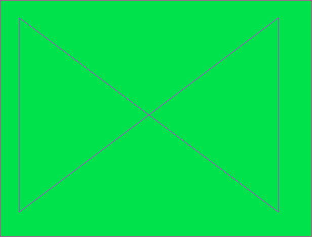

\newpage

  3. GL_LINE_STRIP : Nous avons formé un `N` avec 3 lignes. `GL_LINE_STRIP` créer n-1 lignes pour n points dans le buffer. *On a oublié de prendre une capture d'écran à ce moment-là et nous ne pouvons pas le refaire chez nous, donc on a édité l'image du nœud papillon pour montrer à quoi cela ressemblait.*

  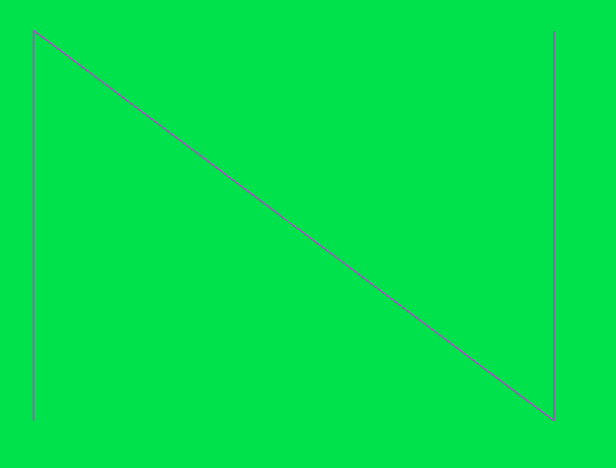

\newpage

  4. GL_LINE_LOOP : Nous avons formé un noeud papillon avec seulement 4 points. `GL_LINE_LOOP` fait comme `GL_LINE_STRIP` mais ajoute aussi une lignes entre le premier et le dernier point.

  

\newpage

  5. GL_TRIANGLE_STRIP : Nous avons formé une étoile en utilisant les propriétés de `GL_TRIANGLE_STRIP`. `GL_TRIANGLE_STRIP` créer un triangle entre chaque 3 points du buffer en se décalant de 1 point à chaque fois.

  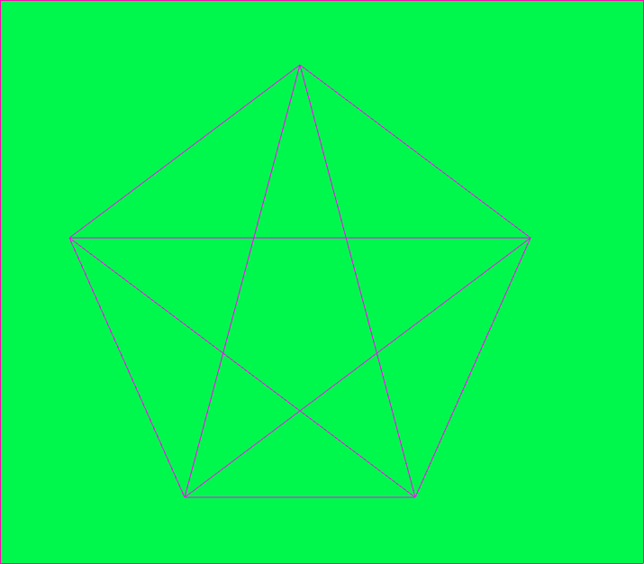

\newpage

  6. GL_TRIANGLE_FAN : Nous avons formé un éventail en utilisant les propriétés de `GL_TRIANGLE_FAN`. `GL_TRIANGLE_FAN` créer des triangles à partir du premier points et avec chaque couple de 2 points qui suivent dans le buffer en se décalant de 1 point à chaque fois.

  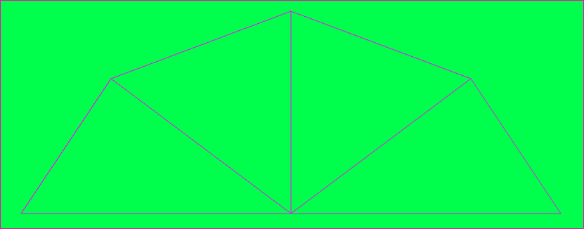

\newpage

- Nous avons utilisé `glEnable(GL_VERTEX_PROGRAM_POINT_SIZE)` et `gl_PointSize = 2.0f` pour initialiser la taille des points. NOus l'avons testé avec notre test de `GL_POINTS` pour voir la modification de la taille des points. Nous avons également mis les points à `10f` dans `gl_PointSize` pour que les points soient bien visibles dans la capture.

  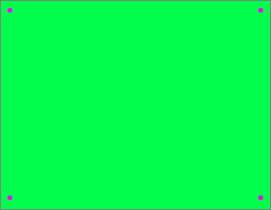

\newpage

- La position en x des points est divisée par 2 donc on écrase la forme sur la largeur.

  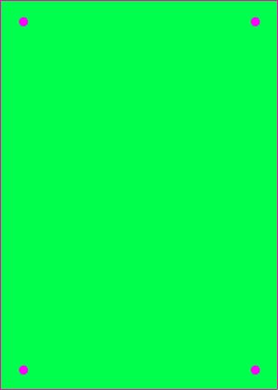
