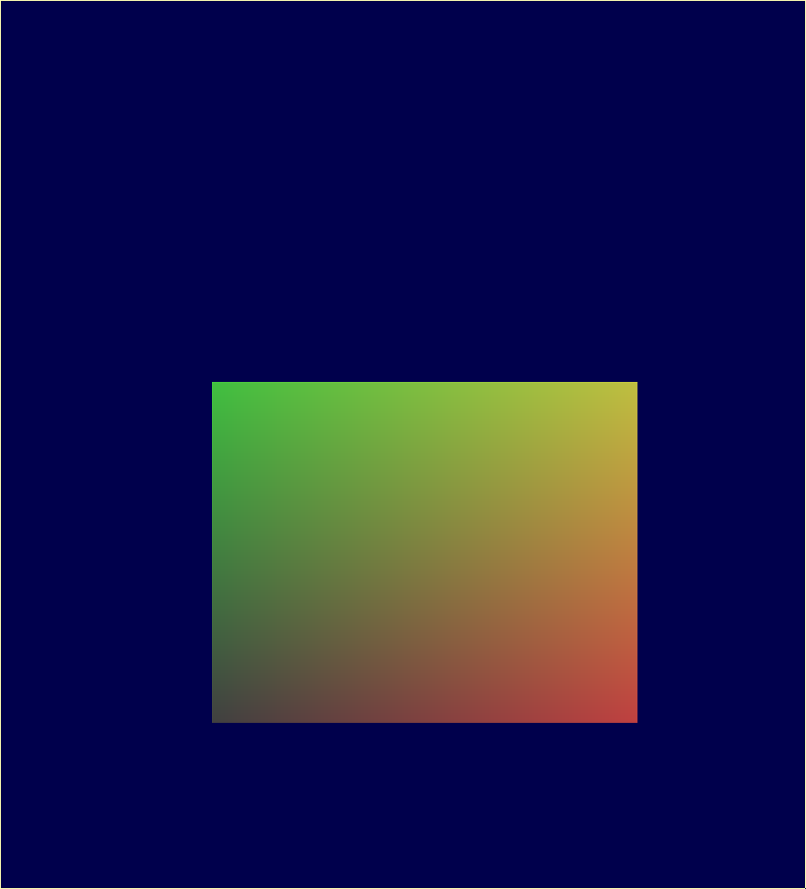

% SI TP2 -- Transformations et Indexation
% Claire VELUT et Mica MURPHY
% Mercredi 22 janvier 2020

# Travail demandé

## Côté *GLSL*

Nous avons copié le code dans `vertex.glsl`.



## Côté *C++*

### Création des matrices

Nous avons copié le code dans `main.cpp`. Il est nécessaire de spécifier une direction verticale pour spécifier si la caméra est "droite" ou "penchée", nous voulons qu'elle regarde comme un personnage debout.


### Changement de point de vue

Nous avons modifié l'initialisation de la matrice de vue en écrivant le code suivant :

```cpp
view_matrix = rotate(view_matrix, 0.25f, vec3(1.0, 0.0, 0.0))
```


```cpp
view_matrix = scale(view_matrix, vec3(2.0, 2.0, 0.0))
```


```cpp
view_matrix = translate(view_matrix, vec3(1.0, 1.0, 0.0))
```


### Animation de la caméra

Pour animer il suffit de faire dans le corps de la boucle :

```cpp
view_matrix = rotate(view_matrix, 0.25f, vec3(0.0, 1.0, 0.0))
```


### Navigation dans la scène

Nous avons choisi d'interpréter la caméra comme un personnage qui regarde le carré, qui se déplace avec les flèches directionnelles, qui se tourne avec ZSQD et qui accélère toutes ses actions en appuyant sur Shift.

## Bonus

Nous n'avons pas eu le temps de faire de bonus.
