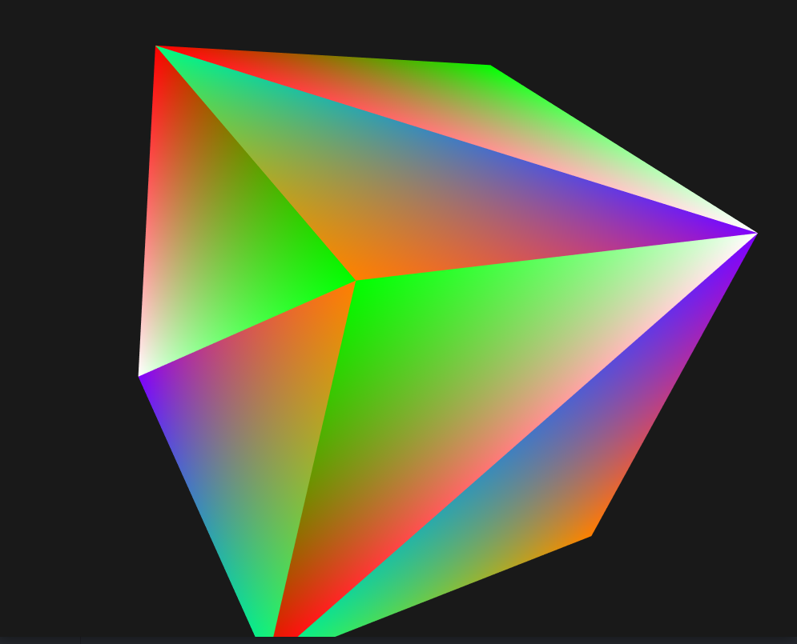
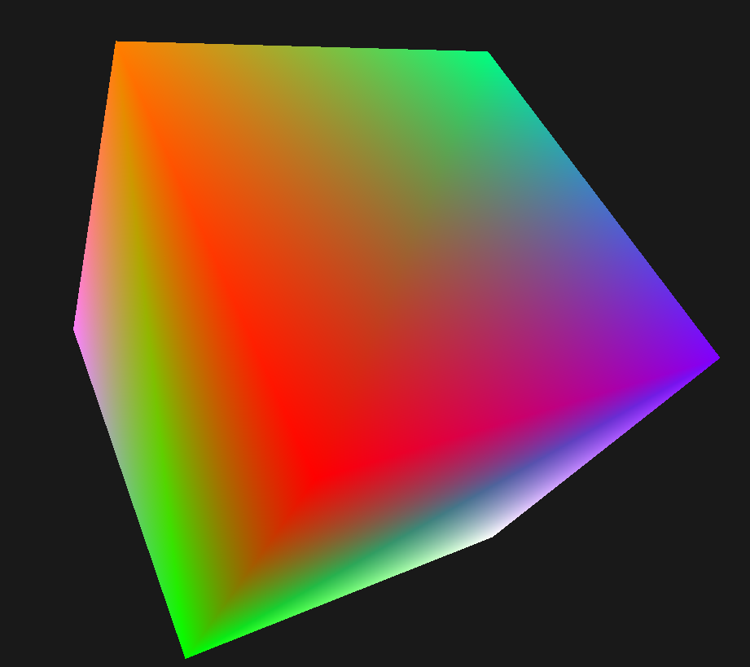
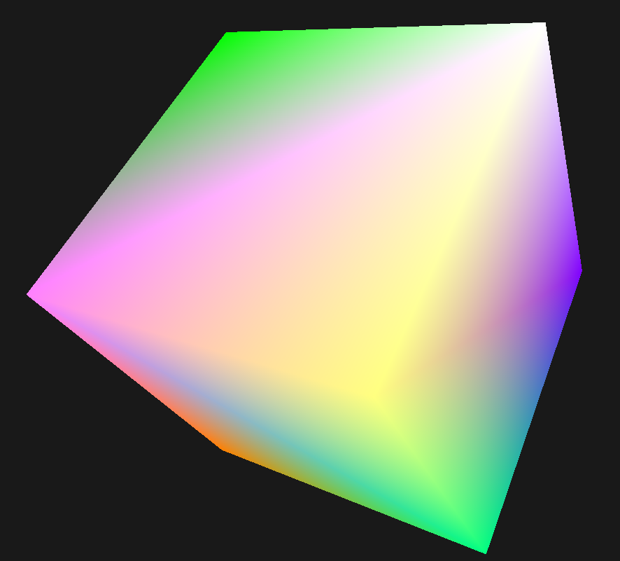
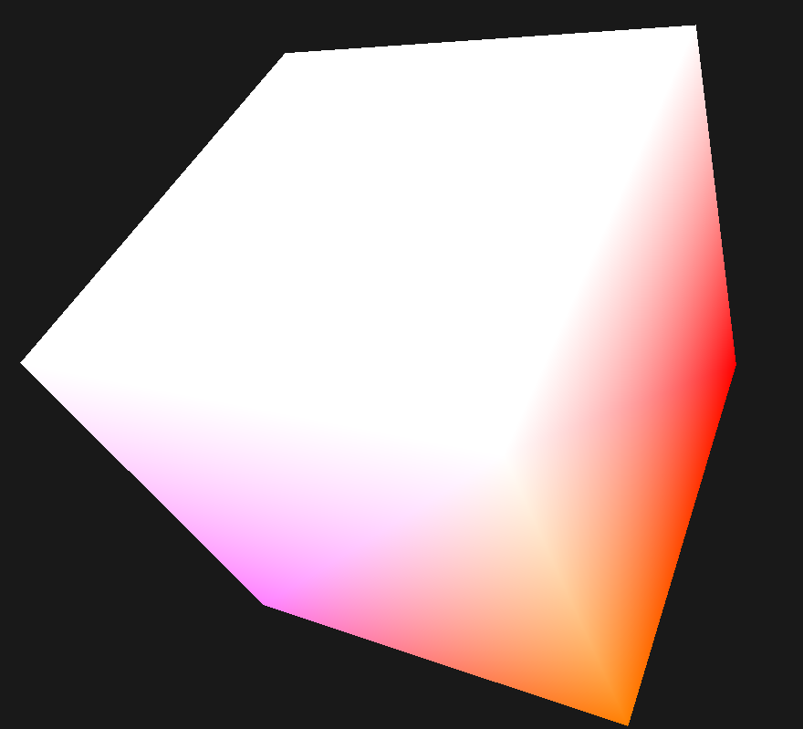
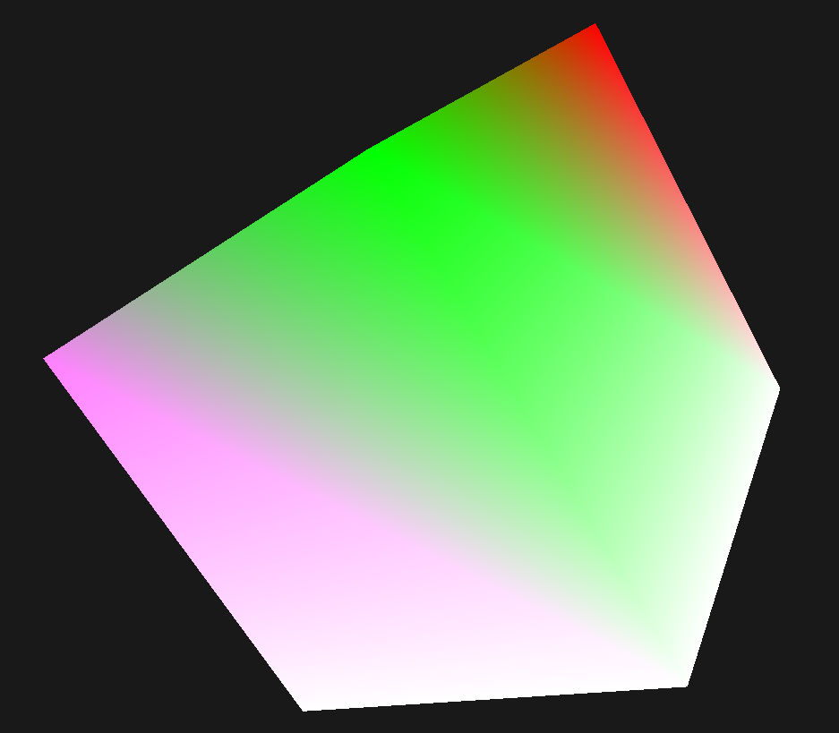

% SI TP3 -- VBO, Maillages et indexation
% Claire VELUT et Mica MURPHY
% Mercredi 29 janvier 2020

# VBO, maillages et indexation

Pour dessiner un cube nous allons faire comme pour le TP précédent en utilisant des triangles : 2 triangles pour un carré donc une face, et 6 faces pour un cube soit 12 triangles et 36 sommets.

Nous avons créé un tableau contenant 36 couleurs (1 couleur pour chaque sommet des triangles) :

```cpp
// Création du vecteur de couleurs
vector<vec3> colors;

// Premier triangle avec 3 couleurs
colors.push_back(vec3(1.,1.,1.));
colors.push_back(vec3(0.,1.,0.));
colors.push_back(vec3(1.,0.,0.));

// Deuxième triangle avec 3 couleurs
colors.push_back(vec3(0.5,0.,1.));
colors.push_back(vec3(0.,1.,0.5));
colors.push_back(vec3(1.,0.5,0.));

// Ces 6 lignes ont été copiées 6 fois (pour les 6 faces)
```



\newpage

## Buffer d'indices

Tous les sommets sont stockés plusieurs fois car ils sont utilisés par différents triangles lors de la créations du cube. Nous avons modifié les vecteurs afin d'avoir 8 couleurs et 8 sommets.

```cpp
// Nouveau vecteur de couleurs
vector<vec3> colors;
colors.push_back(vec3(  1,   1,   1));
colors.push_back(vec3(  0,   1,   0));
colors.push_back(vec3(  1,   0,   0));
colors.push_back(vec3(0.5,   0,   1));
colors.push_back(vec3(  0,   1, 0.5));
colors.push_back(vec3(  1, 0.5,   0));
colors.push_back(vec3(  1,   1, 0.5));
colors.push_back(vec3(  1, 0.5,   1));

// Nouveau vecteur de sommets
vector<vec3> vertices;
vertices.push_back(vec3(-1, -1, -1));
vertices.push_back(vec3(-1, -1,  1));
vertices.push_back(vec3( 1, -1,  1));
vertices.push_back(vec3( 1, -1, -1));
vertices.push_back(vec3( 1,  1, -1));
vertices.push_back(vec3( 1,  1,  1));
vertices.push_back(vec3(-1,  1, -1));
vertices.push_back(vec3(-1,  1,  1));

// Création du vecteur d'indices
vector<uint> indices;
indices.push_back(6); // triangle 1 sommet 1
indices.push_back(3); // triangle 1 sommet 2
indices.push_back(0); // triangle 1 sommet 3
indices.push_back(6); // triangle 2 sommet 1
indices.push_back(4); // triangle 2 sommet 2
indices.push_back(3); // triangle 2 sommet 3

// Pour faire court, le tableau d'indices contient à la fin :

// Face 1 :
//   6, 3, 0,
//   6, 4, 3,
// Face 2 :
//   4, 2, 3,
//   4, 5, 2,
// Face 3 :
//   5, 7, 1,
//   2, 5, 1,
// Face 4 :
//   3, 2, 1,
//   0, 3, 1,
// Face 5 :
//   0, 7, 6,
//   1, 7, 0,
// Face 6 :
//   7, 4, 6,
//   5, 4, 7,
```





\newpage

Pour obtenir une seule couleur par face il faut assigner la même couleur aux quatre sommets de la face.

```cpp
// Vecteur de couleurs avec une face blanche
vector<vec3> colors;
colors.push_back(vec3(  1,   1,   1)); // blanc
colors.push_back(vec3(  0,   1,   0));
colors.push_back(vec3(  1,   0,   0));
colors.push_back(vec3(  1,   1,   1)); // blanc
colors.push_back(vec3(  1,   1,   1)); // blanc
colors.push_back(vec3(  1, 0.5,   0));
colors.push_back(vec3(  1,   1,   1)); // blanc
colors.push_back(vec3(  1, 0.5,   1));
```





\newpage

## Maillage


.
