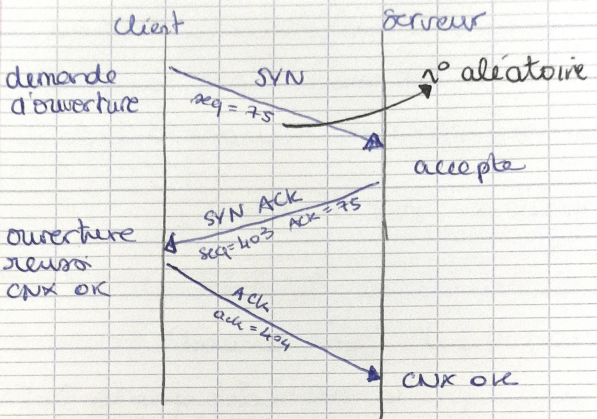
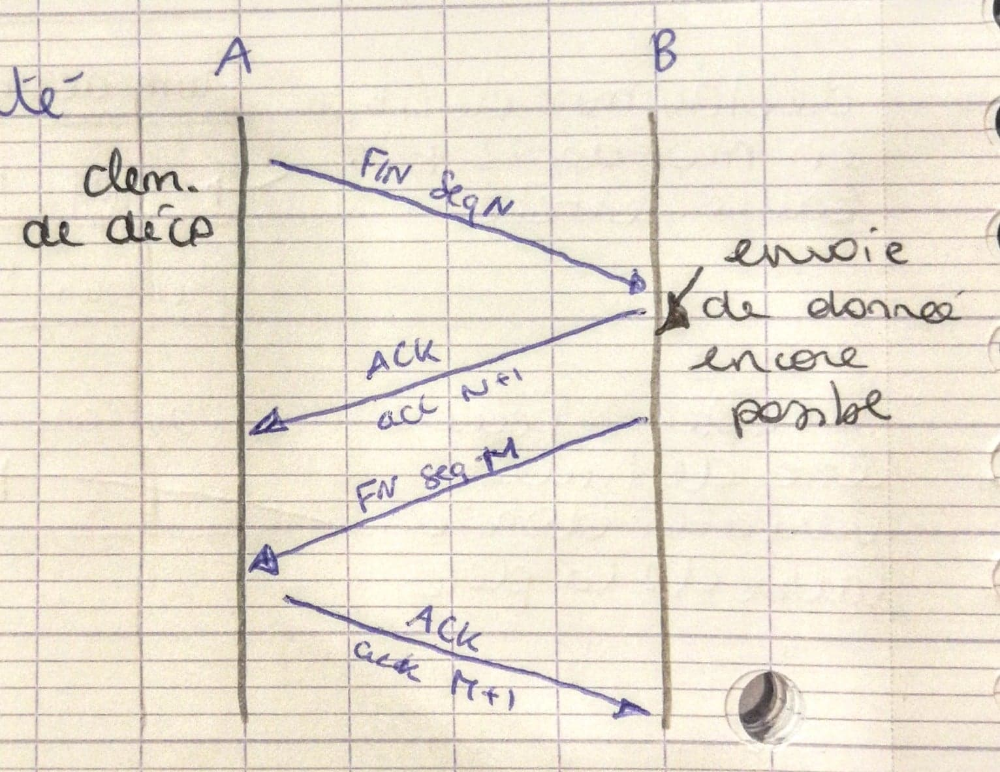
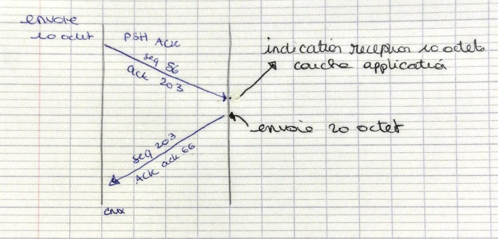

# TR 1 - Modèle en couches, modèle OSI

Technologie des Réseaux

Responsable : Olivier.Richard@imag.fr

**OSI** : *Open Systems Interconnection*

Un modèle basé sur **7 couches** :

```text
                  *-----------*
Application       |           | 7
Présentation      |           | 6
Session           |           | 5
Transport         | TCP / UDP | 4 *
Réseau            | IP        | 3 *
Liaison de donnée | Ethernet  | 2 *
Physique          | Ethernet  | 1
                  *-----------*
* les plus étudiés en cours
```

> L1, L2, L3... = Layer 1, Layer 2, Layer 3...

## IP (Internet protocol)

### Généralités

- **1970.** réseau **Arpanet**
- **Années 80-90.** IP s'impose
- Structure décentralisée
- **IETF (*Internet Engineering Task Force*).** Groupes de travail $$\rightarrow$$ **RFC (*Request For Comment*)** décrit un protocole

IP joue un rôle de protocole d'unification (IP/Ethernet, IP/Numéris, IP/X25, IP/ADSL)

### IPv4

Il assure un service de délivrance de datagramme :

- **sans connexion** $$\rightarrow$$ chaque datagramme va être traité indépendamment
- **non-fiable** $$\rightarrow$$ aucune garantie d'arrivée (ni l'émetteur, ni le récepteur ne sont tenus informé de la perte de datagramme)

#### Adressage

- 1 adresse par carte réseau : 32 bits/4 octets, notation décimale pointée
- 5 classes : bits de poids forts

    ```text
        *------------------------------------------*
    A : | 0     | id reseau (7)  | id machine (24) |
    B : | 10    | id reseau (14) | id machine (16) |
    C : | 110   | id reseau (21) | id machine (9)  |
    D : | 1110  |         adresse multicast        |
    E : | 11110 |             réservé              |
        *------------------------------------------*
    ```

> `0.0.0.0` Quand une machine *boote* et qu'elle ne connaît pas son adresse
>
> `<id R> <id M = 0>` $$\rightarrow$$ désigne un réseau
>
> `<id R> <id M = tous les bits à 1>` $$\rightarrow$$ adresse de diffusion pour le réseau (broadcast)
>
> `255.255.255.255` $$\rightarrow$$ adresse de diffusion du réseau local
>
> `127.X.Y.Z` / `127.0.0.1` $$\rightarrow$$ adresse de rebouclage
>
> Adresse réseau privée $$\rightarrow$$ pas "routé" (`192.168.X.Y`)

Notation CIDR *(Classless Internet Domain Rooting)*

Masque de "sous" réseau variable

```text
Notation "normale" :
      1.          4.        5.       65    -> adresse
1100 0011.0000 0100.0000 0101.0100 0001    -> binaire

      1.        255.      255.      192    -> masque réseau
1111 1111.1111 1111.1111 1111.1100 0000    -> binaire
```

```text
Notation CIDR :
      1.          4.        5.       65/26 -> nombre de 1 spécifiant le netmask
```

#### Routage

Le routage est la fonctionnalité principale de la couche IP. C'est une fonction d'aiguillage $$\rightarrow$$ Sur quel port envoyer le datagramme IP.

Routage spécifié à l'aide d'une **table de routage** :

```text
Destination     | Gateway
----------------|-------------------
@IP_M1          | @IP_Routeur1
@IP_Réseau/24   | @IP_Routeur1
@IP_RéseauL1/26 | @Eth0
@IP_RéseauL2/24 | @Eth1
****            | @IP_R1
```

## UDP & TCP

### Notion de **port**

**NIC.** _Network Interface Card_

Adresse IP (\@IP) $$\rightarrow$$ désigne une machine / un équipement / une NIC $$\rightarrow$$ comment déterminer l'application avec qui communiquer sur un équipement ? $$\rightarrow$$ numéro de port

> Les ports 0-1023 sont réservés (1024 - 65535 libres). On peut tous les retrouver dans `/etc/services` :
>
>   nom    | port | protocole
> :-------:|:----:|:--------:
>   http   |  80  |    TCP
>  https   | 443  |    TCP
>   ftp    |  21  |    TCP
> ftp-data |  20  |    TCP
>   tftp   |  69  |    UDP
>   ssh    |  22  |    TCP

Une "association" entre 2 applications peut être définie de manière _unique_ par le quadruplet \@IP\_SRC, \@IP\_DST, Port\_SRC, Port\_DST (+ "type" de protocole).

### UDP (_User Datagram Protocol_)

**Définition.** Communication avec un minimum de fonctionnalités : pas de contrôle d'arrivée ni de contrôle de séquencement, etc. $$\simeq$$ "IP + numéro de port"

En-tête :

```text
0     15 | 16     31
--------------------
Port SRC | Port DST
Longueur | Checksum
      Données
```

### TCP (_Transmission Control Protocol_)

**Définition.** Transfert fiable sur connection avec :

- Contrôle des données transférées (endommagées, perdues, dupliquées)
- Contrôle de flux $\rightarrow$ mécanisme à fenêtre pour éviter de saturer un récepteur manquant d'espace (buffer)

_Related._ Tube bidirectionnel de flot d'octets et approche de bout en bout (_end-to-end_).

En-tête :

```text
0                               31
----------------------------------
     Port SRC     |    Port DST
        Numéro de séquence
       Numéro d'acquittement
Depl | // | Flags |      Fenêtre
     Checksum     | Pointeur Urgent
               Options
       ...        | ///////////////
               Données
                 ...
```

- **Numéro de séquence.** Indique le numéro du 1er octet présent dans le champ des données.
- **Numéro d'acquittement.** Contient le numéro de séquence du prochain octet attendu (par l'émetteur de ce message) et acquitte tous les précédents octets.
- **Déplacements.** 4 bits en mots de 32 bits, représente la taille de l'entête.
- **FLAGS.** (6 bits)
  - **URG.** Message urgent présent $$\rightarrow$$ utiliser le pointeur msg urg.
  - **ACK.** Champ d'acquittement, peut être pris en compte.
  - **PSH.** (_push_) Les données reçues doivent être immédiatement remontées aux couches supérieures.
  - **RST.** (_reset_) Fermeture de connexion à une erreur irrécupérable.
  - **SYN.** (_synchronize_) Ouverture de connexion (CNX).
  - **FIN.** (_finalize_) Fermeture de connexion (CNX).
  - **Fenêtre.** Nombre d'octets que l'émetteur du message peut encore recevoir (place dans le buffer de réception) = **contrôle de flux**
  - **Options.** (MSS = _Maximum Segment Size_) $$\rightarrow$$ souvent trame max Ethernet

### Ouverture de connexion

Rôle dissymétrique des 2 entités communicantes :

- **Client** : celui qui demande l'ouverture de connection
- **Serveur** : celui qui l'accepte ou non

Le serveur autorise l'ouverture **passive** de connexion ("vue OS") et le client demande une ouverture **active** de connexion.



> Une ouverture de connexion "consomme" 1 ACK

### Fin de connexion

Effectuée par n'importe quelle extrémité, elle se compose de 2 demandes de fermeture.



### Transfert de données



### Gestion des erreurs

Les erreurs sont détectées par l'absence d'acquittement positif à l'expiration d'un temporisateur (timer) : "toutes" les données reçues hors séquence sont mémorisées.

<!-- TODO  -->

### Adaptation à l'environnement

TCP a été conçu pour s'adapter aux :

- **réseaux locaux** (LAN) : latence faible / débit élevé
- **réseaux longues distances** (WAN) : latence élevée / débit variable

### Gestion des temporisateurs

Leur valeur impacte les performances (latence, débit, usage du réseau).

- **Si timer trop petit.** On ré-envoie inutilement à chaque fois des paquets reçus mais pas encore acquittés car le timer est trop court.

  <!-- TODO  -->

- **Si timer trop grand.** On sous-utilise le réseau, le temps de réponse est mauvais..

  <!-- TODO  -->

La durée optimale d'un timer est égal au RTT (*Round Trip Time* / Temps d'Aller-Retour)

**Algorithme de Karn.** Un estimateur du RTT :

$$
RTT_{\text{estimé}} = \text{Moyenne observée} + f(\text{erreur})
$$

*Retransmission rapide de données.*

<!-- TODO  -->

*Limitation du trafic superflu.*

*Exemple.* Les applications intéractives de type connexion à distance (connection non cryptée).

<!-- TODO  -->

En-tête TCP $$\simeq$$ 40 octets, donc rendement de l'échange (niveau TCP) :

$$
{D_{\text{utiles}} \over D_{\text{transmises}}} = {2 \over 2(\text{ACK}) + 2(\text{en-tête et 'a'})} = {2 \over 2 \times 40 + 2 \times (40 + 1)} \simeq 1\%
$$

**Retard d'acquittement.** On retarde l'envoi d'ACK pour favoriser le regroupement de messages. En pratique, le retard est en dizaines de millisecondes. On envoie toujours 3 messages pour 2 octets utiles.

### Algorithme de Nayle

> Importance de limiter le nombre de petits messages :
>
> augmente le nombre de messages dans le routeur $$\rightarrow$$ augmente le risque de perte de paquets $$\rightarrow$$ augmente le nombre de ré-émissions $$\rightarrow$$ augmente le nombre de messages dans le routeur (boucle)

Principe : on ne peut émettre qu'un seul petit paquet non acquitté sur le réseau

- LAN : émission fréquente (car acquittement rapide)
- WAN : délai élevé $$\rightarrow$$ regroupement

**Contrôle de flux.** Il permet d'adapter le rythme d'émission des données au rythme de consommation du récepteur.

- Utilisation du champ `fenetre` de l'entête TCP indiquant la place restante de l'émetteur du message.

### Mécanisme de fenêtre glissante

<!-- TODO  -->

> Le scénario de consommation des données est à priori arbitraire

**Fenêtre vide.** Lorsque E (émetteur) reçoit ACK = N et WIN = 0, E stoppe l'émission et teste périodiquement la fenêtre de R (récepteur) : première tentative en 5 secondes avec 1 paquet de 1 octet, puis double le temps jusqu'à 1 minute. Tant que R ne peut recevoir (R $$\rightarrow$$ ACK=N et WIN=0)

### Syndrome de la fenêtre stupide (*ou silly window*)

Si B annonce une petite fenêtre (suite à une faible consommation de données des couches supérieures) l'émette émet (avec une forte probabilité) un nouveau petit message qui fait redescendre WIN = 0. Cela implique une sous-utilisation du réseau et la multiplication des petits messages, **à éviter**.

**Solution.** Après l'émission de WIN = 0, l'émetteur doit attendre d'avoir assez de place pour envoyer un acquittement pour envoyer un ACK avec WIN=seuil (seuil fonction de MSS et de la mémoire allouée par connection)

### Maîtrise de congestion réseau

- **Problème.** Une machine peut annoncer une grande fenêtre qui dépasse les capacités du réseau traversé. Peut provoquer des pertes de paquets au niveau des routeurs.
- **Proposition.** Chaque machine maintient une **fenêtre de congestion** (FC) pour estimer la capacité du réseau.
  - ***Principe d'utilisation de la FC.*** Quantité maximale de données non acquittées émises = MIN (champ WIN reçu, FC).
  - ***Évolution de FC*** (hypothèse pour la suite WIN reçu >> FC)
  - ***Technique du Slow-Start*** FC0 = 1 MSS (à chaque ACK reçu FC = FC + 1 MSS)

- Problème de sous-utilisation du réseau
- Amélioration :
  - Début slow-start puis évolution linéaire à partir d'un seuil. Croissance exponentielle de FC du début d'émission.
  - Perte de messages : FC = FC/2. Plusieurs versions existent : Tahoe, Réno, Vega.

### Adaptation par le réseau

**Observation.** Oscillation lors de la détection de congestion car tout les équipements terminaux détectent en même temps : baisse forte puis remontée de charge.

**Proposition.** Introduire la notion de routeur actif. RED = *Random Early Detection*. Le routeur surveille le taux d'occupation de ses files d'attentes. Si $$\text{charge} > \text{seuil}_\text{fixé}$$ alors destruction aléatoire de paquets $$\rightarrow$$ détection de congestion anticipée pour certaines connections.
