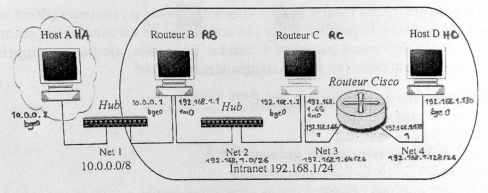

% Réseaux - Comptre-rendu TP1
% Alan Guivarch - Mica Murphy - Claire Velut
% Lundi 23 septembre

# 3.1 Manipulation des tables de routages

2. Plan d'adressage

  

3. Configurations des quatre machines :

   - Host A (HA) :
     ```bash
     route add 0.0.0.0/0      10.0.0.1        # Net 2, 3, 4
     ```
   - Routeur B (RB) :
     ```bash
     route add 192.168.1.64/26  192.168.1.2   # Net 3
     route add 192.168.1.128/26 192.168.1.2   # Net 4
     ```
   - Routeur C (RC) :
     ```bash
     route add 10.0.0.0/8       192.168.1.1   # Net 1
     route add 192.168.1.128/26 192.168.1.66  # Net 4
     ```
   - Host D (HD) :
     ```bash
     route add 0.0.0.0/0        192.168.1.129 # Net 1, 2, 3
     ```

4. TODO Énumérer sur chronogramme liste paquets échangés pendant ping de A vers D (tables ARP vides) avec adresses Ethernet et Internet dans les entêtes

5. `traceroute` envoie 3 paquets avec time to live (TTL) à 1, puis si ça ne suffit pas, il recommence en incrémentant de 1 à chaque nouveau groupe de 3 paquets.

  ```text
  (de A à B, TTL = 1)
  traceroute to 10.0.0.1 (10.0.0.1), 64 hops max, 40 bute packets
   1  10.0.0.1 (10.0.0.1) 0.788 ms  0.206 ms  0.360 ms

  (de A à C, TTL = 2)
  traceroute to 192.168.1.2 (192.168.1.2), 64 hops max, 40 bute packets
   1  10.0.0.1 (10.0.0.1) 0.474 ms  0.331 ms  0.328 ms
   2  192.158.1.2 (192.158.1.2) 0.969 ms  0.502 ms  0.490 ms

  (de A à D, TTL = 4)
  traceroute to 192.168.1.130 (192.168.1.130), 64 hops max, 40 bute packets
   1  10.0.0.1 (10.0.0.1) 0.478 ms  0.363 ms  0.207 ms
   2  192.158.1.2 (192.158.1.2) 0.358 ms  0.504 ms  0.336 ms
   3  192.158.1.66 (192.158.1.66) 0.813 ms  0.975 ms  0.651 ms
   4  192.158.1.130 (192.158.1.130) 0.487 ms  0.663 ms  0.668 ms

  (de C à D, TTL = 2)
  traceroute to 192.168.1.130 (192.168.1.130), 64 hops max, 40 bute packets
   1  192.158.1.66 (192.158.1.66) 0.362 ms  0.317 ms  0.320 ms
   2  192.158.1.130 (192.158.1.130) 0.496 ms  0.498 ms  0.349 ms
  ```

# 3.2 Fonctionnement du protocole RIP

3. a. TODO Énumérer liste paquets RIP échangés et détailler informations contenues dans ces paquets. Est-ce que cette version de RIP implémente la méthode "_split horizon_" ?

  RIPv1 implémente split horizon (http://www.ciscopress.com/articles/article.asp?p=102174&seqNum=3 et https://learningnetwork.cisco.com/thread/132826)

  Cette technique est utilisée pour accélérer la convergence. Le principe est simple, on interdit à un routeur d’envoyer une route à un routeur adjacent quand cette route passe par ce routeur adjacent. (http://idum.fr/spip.php?article213)

  Empêche à un routeur d’envoyer des informations (de métrique plus élevée) à travers l’interface de laquelle elle a appris l’information pour éviter les boucles de routage (https://cisco.goffinet.org/ccna/routage/routage-dynamique-ripv2/)

  (https://laissus.developpez.com/tutoriels/cours-introduction-tcp-ip/?page=page_8)

  (https://en.wikipedia.org/wiki/Routing_Information_Protocol)

  (définitions : https://quizlet.com/104027671/rip-routing-information-protocol-flash-cards/)

    b. TODO Comment à la réception d'un paquet RIP, peut-on connaître les netmasks associés aux adresses de réseau à introduire dans la table de routage ? Comment RIP peut-il "s'en sortir" avec les netmasks que vous avez décidé d'utiliser pour les sous-réseaux ?

5. TODO Conclusion sur RIP et les routes statiques et par défaut ?

6. TODO Que s'est-il passé ? Expliquez.

8. TODO Donnez contenu des nouvelles tables de routage de chaque machine. Expliquez en rappelant l'algorithme des démons de routages RIP ce qu'il s'est passé.

9. TODO Imaginez (et testez) une expérience vous permettant de le savoir.

10. TODO Imaginez (et testez) une expérience vous permettant de le savoir.

11. d. TODO Ces paquets sont émis vers une adresse de groupe (multicast) au lieu du broadcast. Quel intérêt ? Quelles sont les informations supplémentaires circulant dans ces paquets ?

# 3.3 `Traceroute` en vrai

En faisant un `traceroute` vers l'adresse distante `google.com`, on a un TTL à 13. TODO commenter les délais affichés

# Annexe

TODO Pouvez-vous imaginer un cas où RIPv1 pourrait être mis en défaut ?
