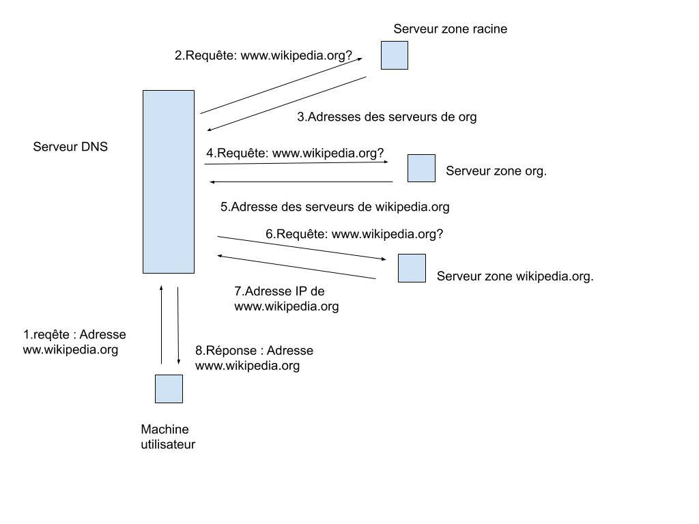

% Réseaux - Compte-rendu TP3
% Alan Guivarch - Mica Murphy - Claire Velut
% Lundi 18 novembre

# Étude de l'application Domain Name System

## 1. Principe de l'interrogation

## 2. Principaux outils pour le DNS

## 3. Configuration de la plate-forme

## 4. Configuration du DNS dans une machine utilisateur

Fichier `/etc/resolv.conf` :

```text
search e.ujf-grenoble.fr
nameserver 152.77.1.22
nameserver 195.83.24.30
```

- Il y a 2 serveurs DNS (correspondant aux deux lignes avec `nameserver`). L'intérêt d'en avoir plusieurs c'est : "[cela permet] de donner plusieurs possibilités d'interrogation pour augmenter la fiabilité du système en cas de panne" (d'après le sujet de TP).

- L'adresse `127.0.0.1` correspond au `localhost` donc la machine elle-même. Cela permet de vérifier si elle ne connaît pas déjà la réponse avant de faire des requêtes à d'autres serveurs. Cela suit bien le principe de faire des requêtes du plus proche au plus loin.

- Par défaut sur le réseau de l'IM2AG le suffixe rajouté par défaut est donné après `search` dans le fichier donc : `e.ujf-grenoble.fr`.

- Le serveur DNS (donné par `host www.google.com.`) que notre machine interroge est : `172.217.171.228` en IPv4 et `2a00:1450:4006:804::2004` en IPv6.

- Oui, le fichier `hosts` est situé en premier dans le fichier `/etc/host.conf` donc est consulté avant le DNS.

- Lorsqu'on fait `ping www.` cela veut dire que l'adresse complète est `www`, or elle n'existe pas donc on a l'erreur `Unknown host`. Alors que lorsqu'on fait `ping www` (sans le point) on indique que l'adresse n'est pas nécessairement complète et qu'on veut essayer de la compléter automatiquement avec les suffixes connus.

- Les majuscules ne sont pas significatives (`ping www` et `ping WWW` renvoient le même résultat).

- La machine `www.ujf-grenoble.fr` existe mais `www.imag.fr` n'existe pas (on a `Unknown host`).

- Lors du ping `www` c'est la machine `www.ujf-grenoble.fr` qui a été interrogée (on trouve l'adresse dans le résultat du ping).

- L'ordre des suffixes dans le fichier `/etc/resolv.conf` est important car on va les tester dans l'ordre jusqu'à en trouver un qui fonctionne. Pour vérifier, on a fait `ping batiment` qui a rajouté le suffixe `imag.fr` qui était le premier dans la liste. Dans le cas précédent, comme `www.imag.fr` n'existe pas on est passé aux suffixes suivants jusqu'à en trouver un qui fonctionne (en l'occurrence le dernier). Donc il faut faire attention à l'ordre lors de l'écriture du fichier.

## 5. Interrogation DNS à l'aide de l'utilitaire `host`

- `host toto`
  - ```text
    host toto not found: 3(NXDOMAIN)
    ```
  - La zone `toto` n'existe pas, elle n'est donc pas trouvée.
- `host www`
  - ```text
    www.ujf-grenoble.fr is an alias for lena.ujf-grenoble.fr
    lena.ujf-grenoble.fr has address 152.77.24.142
    ```
  - La commande complète le `www` par le premier suffixe qui fonctionne, en l'occurrence `ujf-grenoble.fr`. Ensuite elle nous indique que `www.ujf-grenoble.fr` est en fait un alias et nous indique son adresse.

- `host www.`
  - ```text
    host www. not found: 3(NXDOMAIN)
    ```
  - La zone `www` n'existe pas donc `www.` n'est pas trouvé.

- `host mandelbrot`
  - ```text
    mandelbrot.e.ujf-grenoble.fr is an alias for im2ag-mandelbrot.e.ujf-grenoble.fr
    ```
  - L'addresse est automatiquement complétée avec le suffixe qui fonctionne et la commande nous indique que l'adresse est en fait un alias.

- `host altavista`
  - ```text
    host altavista not found: 3(NXDOMAIN)
    ```
  - La zone n'existe pas et aucun des suffixes précisés ne fonctionne.

- `host www.altavista.com`
  - ```text
    www.altavista.com is an alias for us.yhs4.search.yahoo.com
    ```
  - Ici la zone est terminale = c'est une machine. La commande nous indique que c'est un alias.

- `host altavista.com`
  - ```text
    altavista.com has address 74.6.136.151
    altavista.com has address 98.136.103.24
    altavista.com has address 212.82.100.151
    altavista.com has address 106.10.248.151
    altavista.com has address 124.108.115.101
    ```
  - La zone `altavista.com` existe et contient plusieurs machines, la commande nous donne les adresses de toutes les machines dans la zone.

- `host www.nic.fr`
  - ```text
    www.nic.fr is an alias for lb01-1.nic.fr
    lb01-1.nic.fr has address 192.134.5.24
    lb01-1.nic.fr has IPv6 address 2001:67c:2218:30::24
    ```
  - Ici on a aussi une machine mais avec un alias pour simplifier le nom du site. La commande nous donne aussi l'IPv4, et l'IPv6 du site.
- `host www.caramail.com`
  - ```text
    www.caramail.com is an alias for www.gmx.fr
    www.gmx.fr has address 213.165.64.8
    ```
  - La zone `www.caramail.com` est terminale = c'est une machine. La commande nous indique que c'est un alias et nous donne l'adresse de la machine dont elle est l'alias.
- `host www.google.com`
  - ```text
    www.google.com has address 172.217.171.228
    www.google.com has IPv6 address 2a00:1450:4006:804::2004
    ```
  - La zone `www.google.com` est terminale = c'est une machine. La commande nous donne l'IPv4 et l'IPv6 de la machine.
- `host www.google.fr`
  - ```text
    www.google.fr has address 216.58.198.67
    www.google.fr has IPv6 address 2a00:1450:4006:80a::2003
    ```
  - La zone `www.google.fr` est terminale = c'est une machine. La commande nous donne l'IPv4 et l'IPv6 de la machine.
- `host imagate.imag.fr`
  - ```text
    imagate.imag.fr has address 195.221.224.254
    ```
  - La commande nous donne l'adresse.

\newpage

- Le nombre de requêtes dépend du nombre de zones. Quand les suffixes complètent les adresses et sont testés des requêtes (de type DNS) sont envoyées en plus.
- Les requêtes interrogent bien les serveurs apparaissant dans le fichier /etc/resolv.conf. En effet le destinataire des paquets DNS est le premier serveur du fichier.
- Dans certains cas plusieurs adresses apparaissent dans les réponses car les adresses données ne correspondent pas à des zones terminales il y a donc plusieurs machines dans la même zone et la commande nous donne l'adresse de chacune des machines.
- Plusieurs noms DNS peuvent être associé à une même adresse, en effet on peut créer un alias qui est un nom DNS différent qui redirige vers la même adresse.
- Non la liste n'est pas toujours donnée dans le même ordre par le serveur DNS, probablement afin d'éviter d'encombrer toujours le même serveur. En ayant un ordre aléatoire, cela permet à tous les serveurs d'avoir à peu près la même charge.
- Il n'y a pas toujours une adresse IPv6 associée à un nom DNS, en effet cela n'est pas obligatoire, c'est le choix de chacun des domaines (il faut payer pour avoir une adresse supplémentaire).
- host 152.77.1.22 nous permet d'avoir le nom ns2.u-ga.fr.
- DNS utilise le protocole UDP comme protocole de transport, cependant si le message envoyé est trop grand, il pourra utiliser TCP. Le port reservé au serveur DNS est le port 53.
- Serveurs de courrier :
  - Le serveur de courrier de `www.google.fr` est `aspmx.l.google.com`.
  - Le serveur de courrier de `imag.fr.` est `relay.renater.fr`.
  - Le serveur de courrier de `fr.` est `hostmaster.nic.fr`.
  - Le serveur de courrier de `e.ujf-grenoble.fr` est `relay.renater.fr`.
- Un nom canonique (raccourci en CNAME) est un nom de domaine associé à autre un nom de domaine (un alias). Par exemple, l'enregistrement CNAME `bar.example.com. CNAME foo.example.com.` indique que `bar.example.com.` est un alias pour `foo.example.com.` (qui lui-même a une adresse).
- Le nom canonique de `mandelbrot` est `im2ag-mandelbrot.e.ujf-grenoble.fr` (avec le suffixe `e.ujf-grenoble.fr` ajouté automatiquement à `mandelbrot`).
- L'adresse `www.google.com` n'a pas de nom canonique car ce n'est pas un alias. Elle est elle même un nom canonique.
- La commande `-t cname` ne marche pas pour `www.imag.fr` car la machine n'existe pas comme vu précédemment.
- Le nom canonique de l'adresse `www.bonjour.fr` est `www.paruvendu.fr`.
- Les alias permettent d'accéder plus rapidement un une adresse longue. Il faut enregistrer l'alias à son nom canonique.
- Les alias pointent toujours vers un autre nom de domaine et pas vers une adresse IP directement.
- Il est beaucoup plus facile d'acceder à Facebook en utilisant `www.facebook.com` son nom sybolique que sont adresse IPv6 : `2a03:2880:f142:82:face:b00c:0:25de`. Les nom symbolique sont fait pour être facilement retenu, on a pas besoin de se souvenir d'une longue suite de chiffre pour accéder à Facebook.
  - `www.facebook.com` : `2a03:2880:f142:82:face:b00c:0:25de`
  - `www.free.com` : *pas d'adresse IPv6*
  - `www.free.fr` : `2a01:e0c:1::1`
  - `www.youtube.com` : `2a00:1450:4006:803::200e`
  - `www.google.com` : `2a00:1450:4006:804::2004`

\newpage

## 6. Serveurs de zone DNS

- Il y a 13 serveurs pour la zone racine et 5 serveurs pour la zone fr.
  Il y a plusieurs serveurs pour répartir la charge sur différents serveurs.
- Pour la zone imag.fr il y a 2 serveurs: eip1.u-ga.fr et eip2.u-ga.fr
- Les serveurs d'une zone ne sont pas tous géographiquement au même endroit. En effet cela permet que si il y a un problème dans un bâtiment qui contient des serveurs dans un pays X alors la zone DNS ne sera pas complètement bloqué car les serveurs des autres pays seront toujours fonctionnel.
- 9734 machines sont gérées dans le domaine `ujf-grenoble.fr` et 22880 machines sont gérées dans le domaine `u-ga.fr`.
- Par chance cette année on nous a donné l'accès.

- Le nom du serveur primaire de la zone `ujf-grenoble.fr` et de la zone `imag.fr` est eip1.u-ga.fr.
- On associe à un serveur primaire :
  - l'adresse mail de l'administrateur de la zone ;
  - le numéro de série qui est augmenté à chaque changement ;
  - le temps de *refresh* (qui est le temps après lequel les serveurs secondaires doivent  redemander le numéro de série du serveur principal pour détécter un potentiel changement de zone) ;
  - le temps de *retry* (qui est le temps après lequel les serveurs secondaires doivent ressayer de demander le numéro du serveur primaire si ils n'ont pas obtenue de réponse)
  - et le temps de *timeout* (qui est le temps après lequel les serveurs secondaires doivent arrêter de répondre à une demande pour la zone si le serveur primaire ne répond pas).

## 7. Requêtes récursives, système de cache

- Nous avons fait `dig nextinpact.com` une première fois : le *query time* valait 12 msec ;
- La seconde fois il valait 1 msec, ce qui est beaucoup plus rapide. Nous avons testé avec d'autres domaines et à chaque fois le premier était grand et le second valait environ 1 msec.
- Oui il existe un cache, c'est pour cela que la seconde requête dig prend beaucoup moins de temps.

\newpage

## 8. Les requêtes et réponses DNS

- Ne recevant pas de réponse de `www.bonjour.fr` nous avons fait avec `www.wikipedia.org`. Nous avons capturé 2 paquets liés à la résolution DNS, la requête au serveur local et sa réponse.



- D'abord DNS demande a la racine si il sait où se trouve 'www.wikipedia.org.', il renvoie l'adresse de la zone 'org.' . DNS va ensuite demander à la zone 'org.' si il connait 'www.wikipedia.org' il va renvoyer l'adresse de la zone 'wikipedia.org' . Enfin DNS demande à 'wikipedia.org' à

- La machine utilisateur envoie une demande DNS pour connaître l'adresse IP de `www.wikipedia.org` au serveur DNS. Celui-ci va demander à la zone racine la même requête qui lui renverra l'adresse des serveurs de `org.`. Le serveur va donc ensuite demander à la zone `org.` la requête de la machine utilisateur qui lui répondra en lui donnant l'adresse des serveurs de `wikipedia.org.`. Enfin le serveur DNS demande à la zone `wikipedia.org.` la ou les adresses IP de `www.wikipedia.org` que le serveur DNS enverra à la machine utilisateur.

- Une demande DNS contient le nom de l'adresse que recherche l'utilisateur et la classe. Une réponse DNS contient l'ensemble des adresses qui correspondent à la demande de l'utilisateur et leurs classes.

\newpage

## 9. Interrogation inverse : nom associé à une adresse

- Le nom envoyé dans la requête de type DNS est : `1.82.220.195.in-addr.arpa`. Le serveur interrogé est le premier serveur contenu dans le fichier `/etc/resolv.conf`.
- La base de donnée est répartie sous forme d'arbre. Entre chaque points il existe une branche pour tout les digits de l'adresse.


\newpage

## 10. Obtenir un nom de domaine

D'après le site de l'Afnic, la démarche pour déposer un nom de domaine s'effectue par l'intermédiaire d'un bureau d'enregistrement chez lequel on pourra l'acheter. L'Afnic ne réceptionne pas les demandes de création de nom de domaine en direct mais traite automatiquement les demandes pour certains domaines (fr, re, yt, pm wf et tf).

Pour acheter un nom de domaine, on peut par exemple l'acheter chez OVH en rentrant sur <https://www.ovh.com/fr/domaines/> le nom de domaine souhaité.

Quelques exemples de tarifs actuels par extension chez OVH (HT) :

- `.com` : 9,99€ à la création puis 9,99€/an
- `.org` : 8,89€ à la création puis 12,99€/an
- `.eu` : 6,99€ à la création puis 7,99€/an
- `.fr` : 6,99€ à la création puis 6,99€/an
- `.bzh` : 36,99€ à la création puis 49,99€/an
- `.dev` : 9,89€ à la création puis 11,99€/an

Certains noms de domaines coûtent (beaucoup) plus cher car ils sont plus demandés : par exemple `bonjour.online` coûte 9000€ à la création.
