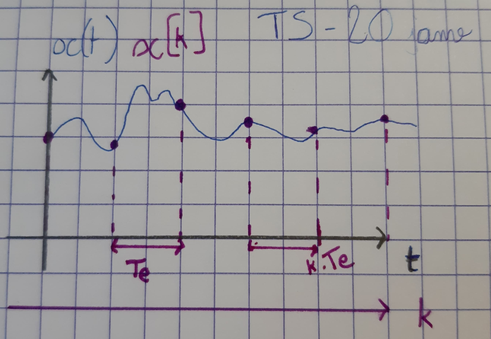
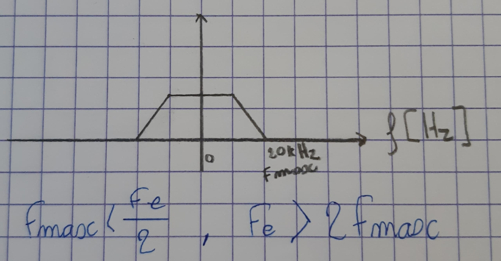
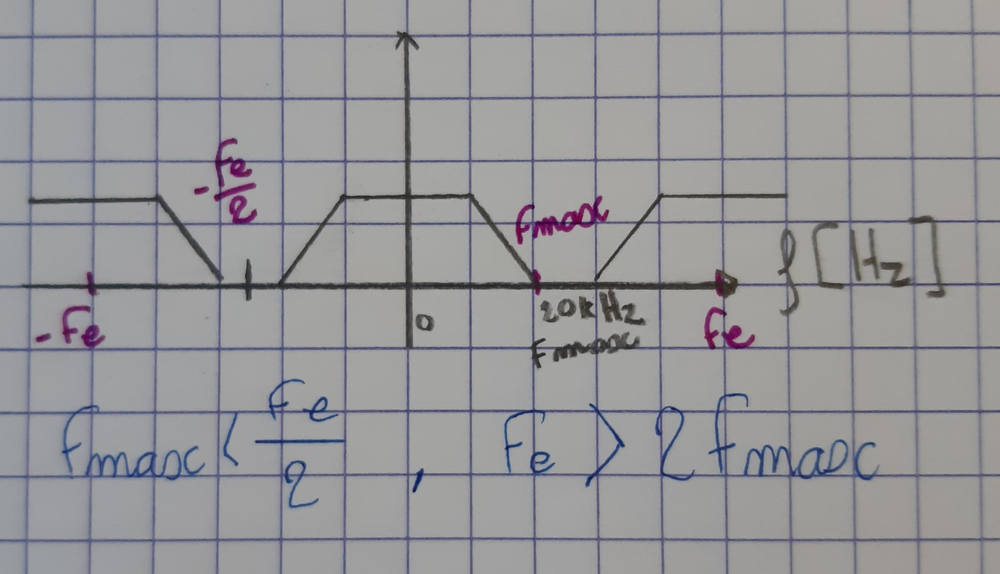
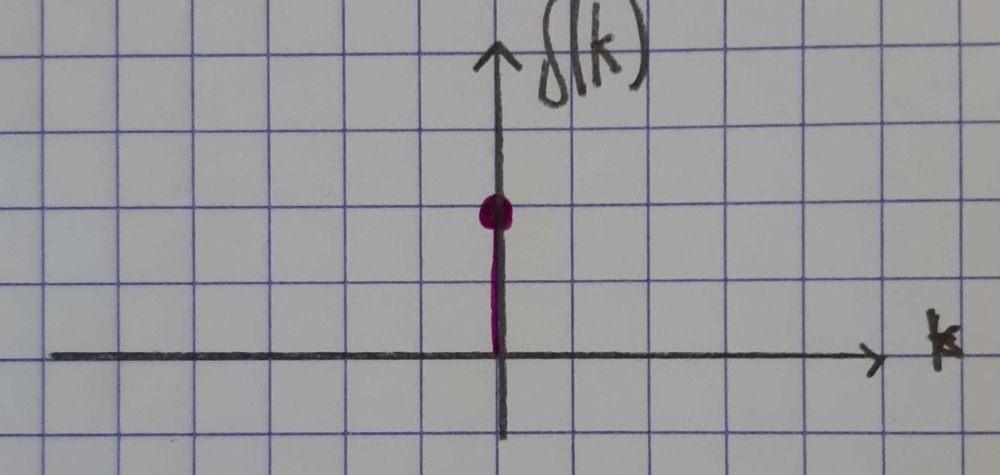
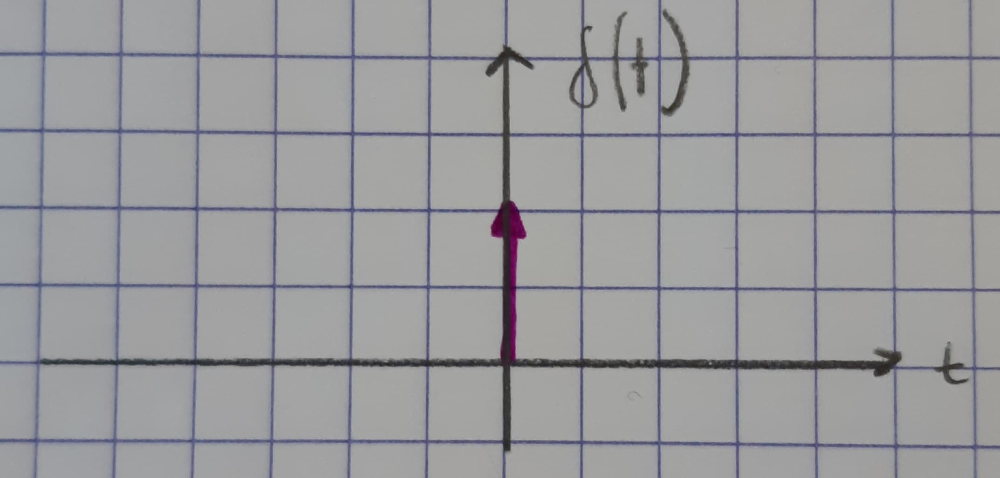
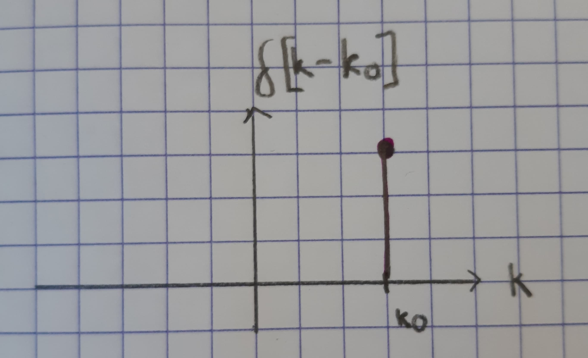
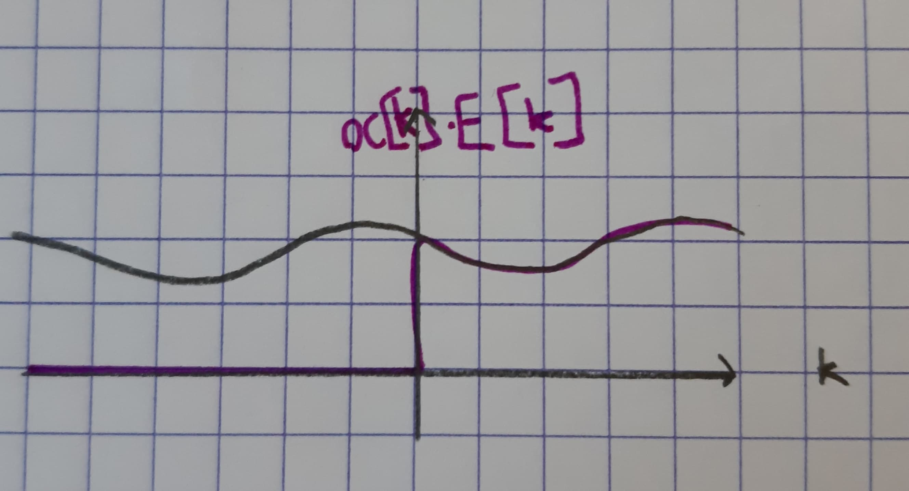

# TS 1 - Signaux et systèmes numériques

**Exam + CC + Quicks**

**Exam 70%** 2H

**CC 25%** : DM + CR de TP

**Quicks 5%** en début de cours

Cours : <anne.guerin@gipse-lab.grenoble-inp.fr>

TP : <patricia.ladret@gipse-lap.grenoble-inp.fr>

## Signaux numériques (2.1)

**Polycopié (mis à jour)** : <https://im2ag-moodle.e.ujf-grenoble.fr/pluginfile.php/43173/mod_resource/content/2/Notes_Cours_2019_Chapitre1Version30Janv.pdf>

### Définitions

Signal discret en temps : $x[k]\; k \in \mathbb{Z}$

Signal continu en temps : $x(t)\; t \in \mathbb{R}$

On passe de $x(t)$ à $x[k]$ en échantillonnant à une période ${1 \over F_e} = T_e$



> *Notation.* Minuscule en temps, majuscules après transformée

**Théorème de Shannon.** $F_{\max} < {F_e \over 2}$, ou autrement écrit $F_e > 2F_{\max}$



> Si la fréquence maximale est 20kHz alors la fréquence d'échantillonage doit être au moins deux fois 20000kHz.

*Pourquoi ?* Échantilloner en temps périodise en fréquence donc les fréquences vont se répéter avec une période $F_e$. Pour ne pas avoir de chevauchement des fréquences (ou *repliement de spectre*), il faut respecter le Théorème de Shannon.



> La transformée en temps discret est périodique de période $F_e$.

### Signaux communs

#### Impulsion de Dirac

Grossièrement, c'est une impulsion en 0 avec une aire de 1 (donc pas nécessairement de hauteur 1).

**Numérique.** Noté $\delta[k]$                         | **Analogique.** Noté $\delta(t)$
--------------------------------------------------------|---------------------------------------------
$k = 0\; \delta[k] = 1$                                 | $\lim\limits_{t \to 0} \delta(t) = + \infty$
$k \neq 0\; \delta[k] = 0$                              | $t \neq 0\; \delta(t) = 0$
$\sum\limits_{k=-\infty}^{+\infty} \delta[k] = 1$       | $\int_{-\infty}^{+\infty} \delta(t) dt = 1$
 | 



#### Échelon

*Grossièrement si on multiplie un signal par un échelon, on "coupe" ce signal en-dessous de $0$.*

$\epsilon[k] = \left\{\begin{array}{ll}
1, & k \geq 0\\
0, & k < 0\\
\end{array}\right.$




#### Rectangle

$\text{Rect}_K[k] = \left\{\begin{array}{ll}
1, & 0 \leq k < K\\
0, & \text{sinon}\\
\end{array}\right.$

> $\text{Rect}_K[k]$ est un signal de durée $K(K \times T_e)$.

#### Signal exponentiel

$$x|k] = a^k (\times \epsilon[k])$$

#### Signal sinusoïdal / cosinusoïdal de période $K$

$$x|k] = A \sin\Big(2 \pi {k \over K}\Big)$$

$$x|k] = A \cos\Big(2 \pi {k \over K}\Big)$$

## Systèmes numériques

```text
x[k] -> [ S ] -> y[k]
```

$$
y[k] = S\{x\}[k]
$$

### Linéaire

$$
\begin{array}{lcl}
\alpha_1 y_1[k] + \alpha_2 y_2[k] & = & S\{\alpha_1 x_1[k] + \alpha_2 x_2[k]\}[k]\\
 & = & \alpha_1 S\{x_1[k]\} + \alpha_2 S\{x_2[k]\}[k]\\
\end{array}
$$

### Causalité

Un système est causal quand il est excité ($\neq 0$) à partir de 0 et pas avant.

> Une conséquence ne peut arriver avant la cause.

Le système spatiaux comme une image en 2D ne peuvent pas appliquer le principe de causalité. Cela dit, pour un signal vidéo, structuré par le temps, on peut appliquer le principe de causalité sur le temps. Ce n'est pas le cas d'une image fixe qui est uniquement structurée par ses pixels.

### Invariance en temps (SLIT)

$$y[k] = S\{x\}[k]$$

$$S\{x[k - k_0]\}[k] = y[k - k_0]$$


> En cours nous allons utiliser des systèmes invariants en temps, mais pas tous causaux.

## Équations aux différences (2.2)

```text
x[k] -> [ S ] -> y[k]
```

On a vu qu'on s'intéressait en cours uniquement aux Systèmes Linéaires Invariants en Temps (= SLIT). Tous les SLIT sont tels que la relation entre $y$ et $x$ est régie par $S$ : une équation aux différences.

$$
\sum\limits_{n=0}^{N} a_ny[k - n] = \sum\limits_{m=0}^{M} b_m x[k - m]
$$

$$
a_0 y[k] + a_1 y[k - 1] + ... + a_N y[k - N] = b_0 x[k] + b_1 x[k - 1] + ... + b_M x[k - M]
$$

$$
y[k] = {1 \over a_0}[(b_0x[k] + \dots + b_nx[k - n]) - (a_1y[k-1] + \dots + a_Ny(k - N))]
$$

**Interprétation.** La sortie à l'instant présent est égale à la combinaison linéaire des entrées à l'instant présent et au passé soustrait à la combinaison linéaire du passé des sorties.

> *Remarque.* Connaître $S$ c'est comme connaître tous les paramètres $\{a_n | n=0...N ; b_m | m=0...M\}$.

*Exemple.* Le filtre gradient (dérivée dans $\mathbb{Z}$), *filtre direct*

- $y[k] = x[k] - x[k - 1]$
- $a_0 = 1$, $a_{2..n} = 0$
- $b_0 = 1$, $b_1 = -1$, $b_{2..n} = 0$
- **Ordre** = max(Ordre 0 *feedback*, ordre 1 *feedforward*) = 1

> L'ordre du filtre correspond à "jusqu'à combien on regarde dans le passé".

Un filtre est dit **récursif** lorsqu'il **utilise les sorties** passées du filtre pour calculer le présent. Sinon, le filtre est dit **direct** ou non récursif ou à **Réponse Impultionnelle Finie** (voir 2.6).

*Exemple.* Filtre récursif.

- $y[k] = x[k] - y[k - 1] + y[k - 2]$
- $a_0 = 1$, $a_1 = 1$, $a_2 = -1$
- $b_0 = 1$
- **Ordre** = max(Ordre 2 *feedback*, ordre 0 *feedforward*)

$$
y[k] = {1 \over a_0}\Big(\sum\limits_{m=0}^{M} b_m x[k-m] - \sum\limits_{n=1}^{N} a_n y[k-n]\Big)
$$

## Réponse impulsionnelle (2.3)

La réponse impulsionnelle est la réponse du passage d'un dirac (une impulsion) à travers un système. On obtient $h[k]$.

À partir de $h[k]$, pour tout signal $x[k]$ on peut trouver $y[k]$ en faisant le produit de convolution $x[k]; h[k]$.

$$
x[k] = \sum\limits_{l=-\infty}^{+\infty} x[l] \delta [k - l]
$$

$$
y[k] = S\{x\}[k] = \text{fct}(x[k];h[k]) \text{ avec fct un produit de convolution}
$$

**Preuve** de la relation entre $y$ et la fonction de convolution :

$$
\begin{array}{lcl}
y[k] & = & S\{x\}[k]\\
 & = & S\Big\{\sum\limits_{l=-\infty}^{+\infty} x[l] \delta[k-l]\Big\}\\
 & = & \sum\limits_{l=-\infty}^{+\infty} S\Big\{x[l] \delta[k-l]\Big\}\\
 & = & \sum\limits_{l} x[l] S\{\delta [k - e]\} \\
 & = & \sum\limits_{l = -\infty}^{+ \infty} x[l]h[k - l]\\
 & = & \sum\limits_{l = -\infty}^{+ \infty} x[k-l]h[l]\\
 & = & (x * h)[k]
\end{array}
$$

## Produit de convolution (2.4)

### Rappel analogique

Soit $x(t)$, $h(t)$ :

$$
\begin{array}{lcl}
x(t) * h(t) & = & \int_{-\infty}^{+ \infty} x(\tau)h(t - \tau)d\tau\\
 & = & \int_{-\infty}^{+ \infty} x(t - \tau)h(\tau)d\tau\\
\end{array}
$$

### Exemple 1

- Équation aux différences : $y[k] = x[k] - ay[k - 1]$
- Que vaut $h[k]$ (sachant que $h[-1] = 0$ car c'est un filtre causal) ?
  - $x[k] = \delta[k]$
  - $h[0] = \delta[0] - ah[-1] = 1$
  - $h[1] = \delta[1] - ah[0] = 0 - a \times 1 = -a$
  - $h[2] = \delta[2] - ah[1] = 0 - a (-a) = a^2$
  - $h[3] = ... = -a^3$
  - On devine la régularité : $\boxed{h[k] = (-a)^k \epsilon[k]}$ *($0$ pour $k < 0$)*

**Application** (on cherche à vérifier que les deux méthodes donnent effectivement le même résultat) :
On choisit $x[k] = \epsilon[k]$ (on appelle le résultat d'un échelon à travers un filtre la **réponse indicielle**).

Avec l'équation aux différences :

- $y[0] = \epsilon[0] - ay[-1] = 1$
- $y[1] = \epsilon[1] - ay[0] = 1 - a \times 1 = 1 - a$
- $y[2] = \epsilon[2] - ay[1] = 1 - a (1 - a) = 1 - a + a^2$
- $y[3] = \epsilon[3] - ay[2] = 1 - a(1 -a + a^2) = 1 - a + a^2 - a^3$
- $y[k] = 1 - a + a^2 + ... + (-a)^k = \sum\limits_{l=0}^{k} (-a)^l$, $k \geq 0$

Avec la réponse impulsionelle :

Soit $y[k] = \epsilon[k] * h[k]$ et $h[k] = (-a)^k\epsilon[k]$

$$
y[k] = \sum\limits_{l=- \infty}^{+ \infty} \epsilon[l].h[k -l] = \sum\limits_{l=-\infty}^{+ \infty} \epsilon[k - l].h[l] = \sum\limits_{l=0}^{k} \epsilon[k - l].h[l]
$$

On peut simplifier les bornes de la somme car $h[l]$ est causal donc $= 0\; \forall l < 0$, et $\epsilon[k - l] = 0\; \forall l > k$. L'échelon $\epsilon$ étant toujours égal à 1 pour la somme avec les nouvelles bornes, plus la peine de le garder dans la formule : $y[k] = \sum\limits_{l = 0}^{k} (-a)^l,\; k\geq 0$.

Preuve par le calcul :

$$
y[k] = \sum\limits_{l=-\infty}^{+\infty} \epsilon[k - l].h[l] = \sum\limits_{l=-\infty}^{+\infty} \epsilon[k - l] (-a)^{k - l}\epsilon[k - l]
$$

Or, $\epsilon[l] = 0$ pour $l < 0$ et $\epsilon[k - l] = 0$ pour $k - l < 0$, donc pour $l > k$.

$$
y[k] = \sum\limits_{l=0}^{k} (-a)^{k - l}
$$

On veut vérifier si on ne s'est pas trompés. On pose $n = k - l$.

$$
y[k] = \sum\limits_{l=0}^{k} (-a)^{k - l} = \sum\limits_{n=k}^{n=0} (-a)^{n} = \boxed{\sum\limits_{n=0}^{n=k} (-a)^{n}}
$$

> *Remarque.* Le **produit** de convolution est **stable** : le produit de 2 signaux causaux est un signal causal. Et son **élément neutre** est $\delta[k]$ : $x[k] * \delta[k] = x[k]$ (pour s'en convaincre on peut faire l'application pour $x[k]$ ou pour $x[k - k_0]$).

## Stabilité "EBSB" (2.5)

**EBSB.** Entrée Bornée, Sortie Bornée $\Leftrightarrow$ sa réponse impultionnelle est absolument sommable $\Leftrightarrow$ $\sum\limits_{k=-\infty}^{+\infty} |h[k]| < M$ donc borné, converge.

## Filtrage récursif et non récursif (2.6, ex 2.9)

1. $y[k] = \sum\limits_{m=0}^{M} b_m x[k - m] - 0$ (filtre direct)
2. $y[k] = \sum\limits_{l=-\infty}^{+\infty} x[l] h[k - l] = \sum\limits_{l=0}^{M} h[l] x[k - l]$

D'où $b_m = h[l]$ (dans la deuxième formule) pour un filtre direct.

*Exemple.* Soit $h[1] = 1$ et $h[5] = -3$ on peut trouver l'équation aux différences : $y[k] = h[0]x[0] + h[1]x[1] + ... + h[5]x[5] = x[k] - x[k - 1]$.


Équation de convolution ($x[k]$ causal, $h[k]$ causal $\Rightarrow$ $y[k]$ causal) :

$$
y[k] = (x*h)[k] = \sum\limits_{l=-\infty}^{+\infty} x[l] h[k - l] = \sum\limits_{l=\boxed{0}}^{\boxed{k}} x[l] h[k - l]
$$

Pour les filtres directs (la partie avec les $a_n$ n'existe pas ici) :

$$
y[k] = \sum\limits_{m=0}^{M} b_m x[b - m] = \sum\limits_{l=0}^{k} x[l] h[k - l]
$$

> **Remarque.** Un filtre est dit direct ou non récursif ou à réponse impulsionelle finie (**RIF**) car à partir d'un certain rang $k$, sa réponse impultionnelle vaut $0$.

> **Remarque.** Un filtre récursif est à réponse impulsionelle infinie (**RII**).

*Rappel.*

- RIF : $y[k] = \sum\limits_{m = 0}^M b_m x[k - m] - \sum\limits_[n = 1]^N a_n y[k - n]$ (temps de calcul proportionnel au $k$)
- RII : $y[k] = \sum\limits_{l = 0}^k x[l] h[k - l] = \sum\limits_[l = 0]^k x[k - l] h[l] = (x*h)[k]$ (temps de calcul rapide pour petit $k$)

## Réponse en fréquence (2.7)

**En temps :**

```text
x[k] -> [ S ] -> y[k] = S{x}[k]
```

- Équation aux différences
- Réponse impulsionelle $h[k]$

**En fréquence :**

$\text{TF}\{x[k]\}(f)=X(f)$ avec $f[Hz]$ fréquence

Une seule équation à retenir, la TF continue :

$$
x(t) \leftrightarrow X(f) = \int_{- \infty}^{+ \infty} \boxed{x}(t) \exp (\boxed{-}2 \pi j f t) dt
$$

$$
X(t) \leftrightarrow x(t) = \int_{-\infty}^{+\infty} \boxed{X}(f) \exp (\boxed{+} 2\pi jft)df
$$

Pour passer à la TF temps discret (**TFTD**), on passe d'intégrale à somme et on utilise les $T_e$ ($t = kT_e$) :

$$
X(f) = \sum\limits_{k=-\infty}^{=\infty} x(kT_e)\exp (-2\pi jkT_e) = \sum\limits_{k=-\infty}^{+\infty} x[k] \exp (-2 \pi {f \over F_e}k)
$$

> **Rappel.** $T_e = {1 \over F_e}$

**Fréquence réduite.** $\lambda = {f \over F_e}$ la fréquence "normalisée"

**Prop.** $X(f + F_e) = X(f)$ l'échantillonage a périodisé (de période $F_e$) le spectre de fréquences.


$$
X(\lambda) = \sum\limits_{k=-\infty}^{+\infty} x[k] \exp (-2 \pi j \lambda k)
$$

**Périodicité 1.**

$$
X(\lambda + 1) = X(\lambda)
$$

**TF de $y$ produit des TF.**
$$
Y(\lambda) = \sum\limits_{k=-\infty}^{+\infty} y[k] \exp (-2 \pi j \lambda k)
$$


$$
y[k] = (x * h)[k]
$$

$$
\begin{array}{lcl}
TF\{y[k]\}(f) & = & TF\{(x * h)[k]\}(f)\\
 & = & TF\{x[k]\}\times TF\{h[k]\}(f)\\
 Y(f) & = & X(f) \times H(f)
\end{array}
$$

**$y$ à partir de la TF inverse.**
$$
y[k] = TF^{-1}\{Y(f)\}[k]
$$

**TF inverse (TFTD$^{-1}$).**
$$
\begin{array}{lcl}
x[k] & = & {1 \over F_e} \int_{-F_e \over 2}^{+ F_e \over 2} X(f) \exp (-2 \pi j {f \over F_e})df \\
 & = & T_e \int_{-F_e \over 2}^{+ F_e \over 2} X(f) \exp (-2 \pi j {f \over F_e})df \\
 & = & \int_{-0.5}^{+ 0.5} X(\lambda ) \exp (-2 \pi j \lambda k)d \lambda \\
\end{array}
$$

**Exemple.**
$$
\left\{\begin{array}{lcl}
h(\lambda) & = & \\
 & = & \\
\end{array}\right.
$$

## Rappels

### TFTD

- $x[k] \leftrightarrow X(f) = \sum\limits_{k=-\infty}^{+infty} x[k] exp(-2 \pi j {f \over F_E} k)$
- $\lambda = {f \over F_E}$
- $X(\lambda) = \sum\limits_{k=-\infty}^{+infty} x[k] \exp(-2 \pi j \lambda k)$
- $x[k] = {1 \over F_E} \int_{-{F_E \over 2}}^{+{F_E \over 2}} X(\lambda) \exp(+2 \pi j k {f \over F_E}) d f$
- $x[k] = {1 \over 1} \int_{-0,5}^{+0,5} X(\lambda) \exp(+2 \pi j k \lambda) d \lambda$

### Convolution

- $x[k] \leftrightarrow X(f)$
- $x[k] * h[k] \leftrightarrow X(f) \times H(f)$
- $x[k - k_0] \leftrightarrow X(f) \times \exp(-2 \pi j k_0 \lambda)$

### Filtre / $h[k]$

$$
y[k] = x[k] * h[k]
$$

$$
TFTD\{y[k]\}(\lambda) = TFTD\{x[k]*h[k]\}(\lambda)
$$

$$
Y(\lambda) = X(\lambda) - H(\lambda)
$$

La caractérisation du filtre en fréquence est : $H(\lambda) = {Y(\lambda) \over X(\lambda)}$ avec $H(\lambda)$ la fonction de transfert.

### Filtre / équation aux différences

$$
y[k] = \sum\limits_{m=0}^{M} b_m \times x[k - m] - \sum\limits_{n=1}^{N} a_n \times y[k - n]
$$

$$
Y(\lambda) = \sum\limits_{m=0}^{M} b_m TFTD\{x[k - m]\}(\lambda) - \sum\limits_{n=1}^{N} a_n TFTD\{y[k - n]\}(\lambda)
$$

$$
Y(\lambda) = \sum\limits_{m=0}^{M} b_m X(\lambda) \exp(-2 \pi j m \lambda) - \sum\limits_{n=1}^{N} a_n Y(\lambda) \exp(-2 \pi j n \lambda)
$$

$$
Y(\lambda) (1 + \sum\limits_{n=1}^{N} a_n \exp(-2 \pi j n \lambda)) = X(\lambda) (\sum\limits_{m=0}^{M} b_m \exp(-2 \pi j m \lambda))
$$

$$
{Y(\lambda) \over X(\lambda)} = {\sum\limits_{m=0}^{M} b_m \exp(-2 \pi j m \lambda) \over 1 + \sum\limits_{n=1}^{N} a_n \exp(-2 \pi j n \lambda)} = H(\lambda)
$$

## Réponse harmonique (2.9)

$$
\begin{array}{lcl}
x[k] & = & \cos(2 \pi {f_0 \over F_E} k) + j \sin(2 \pi {f_0 \over F_E} k)\\
 & = & \exp(2 \pi j {f_0 \over F_E} k)\\
 & = & \exp(2 \pi j \lambda_0 k)\\
\end{array}
$$

> $\lambda_0 = {f_0 \over F_E}$

Pour les **signaux harmoniques** :

$$
\begin{array}{lcl}
y[k] & = & h[k] * x[k]\\
& = & \sum\limits_{l=-\infty}^{+\infty} h[l] \times x[k - l]\\
& = & \sum\limits_{l=-\infty}^{+\infty} h[l] \times \exp(2 \pi j \lambda_0 (k - l))\\
& = & \exp(2 \pi j k \lambda_0) \sum\limits_{l=-\infty}^{+\infty} h[l] \times \exp(2 \pi j \lambda_0 l)\\
& = & x[k] \times H(\lambda_0)\\
\end{array}
$$

avec $x[k] = \exp(2 \pi j \lambda_0 k)$.
